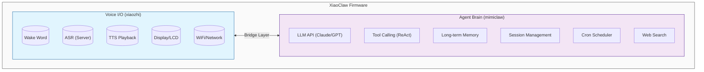

# XiaoClaw: AI Voice Assistant with Local Agent Brain

<p align="center">
  <strong>ESP32-S3 AI Voice Assistant — Voice I/O + Local LLM Agent</strong>
</p>

<p align="center">
  <a href="LICENSE"></a>
  <a href="https://github.com/anthropics/claude-code"></a>
</p>

---

## Introduction

**XiaoClaw** is a unified ESP32-S3 firmware that combines voice interaction with a local AI agent brain. It integrates:

- **xiaozhi-esp32** — Voice I/O layer: audio recording, playback, wake word detection, display, and network communication
- **mimiclaw** — Agent brain: LLM-powered reasoning, tool calling, memory management, and autonomous task execution

All running on a single ESP32-S3 chip with 32MB Flash and 8MB PSRAM.



## Features

### Voice I/O Layer (xiaozhi)
- Offline wake word detection ([ESP-SR](https://github.com/espressif/esp-sr))
- Streaming ASR + TTS via server connection
- OPUS audio codec
- OLED / LCD display with emoji support
- Battery and power management
- Multi-language support (Chinese, English, Japanese)
- WebSocket / MQTT protocol support

### Agent Brain Layer (mimiclaw)
- LLM API integration (Anthropic Claude / OpenAI GPT)
- ReAct agent loop with tool calling
- Long-term memory (SPIFFS-based)
- Session management with conversation history
- Cron scheduler for autonomous tasks
- Web search capability (Tavily / Brave)

## Hardware Requirements

- **ESP32-S3** development board
- **32MB Flash** (minimum 16MB)
- **8MB PSRAM** (Octal PSRAM recommended)
- Audio codec with microphone and speaker
- Optional: LCD/OLED display

### Supported Boards

XiaoClaw inherits board support from xiaozhi-esp32, including:
- ESP32-S3-BOX3
- M5Stack CoreS3 / AtomS3R
- LiChuang ESP32-S3 Development Board
- LILYGO T-Circle-S3
- And 70+ more boards...

## Quick Start

### Prerequisites

- ESP-IDF v5.5 or later
- Python 3.10+
- CMake 3.16+

### Build

```bash
# Clone the repository
git clone https://github.com/your-repo/xiaoclaw.git
cd xiaoclaw

# Set target
idf.py set-target esp32s3

# Configure (optional)
idf.py menuconfig

# Build
idf.py build
```

### Flash

```bash
# Flash and monitor
idf.py -p PORT flash monitor
```

### Configuration

Create `main/mimi/mimi_secrets.h` from the example:

```c
#define MIMI_SECRET_WIFI_SSID       "YourWiFiName"
#define MIMI_SECRET_WIFI_PASS       "YourWiFiPassword"
#define MIMI_SECRET_API_KEY         "sk-ant-api03-xxxxx"
#define MIMI_SECRET_MODEL_PROVIDER  "anthropic"  // or "openai"
```

## Architecture

### Bridge Layer

The bridge layer connects the voice I/O layer with the agent brain:


### Memory Layout

| Partition | Size | Purpose |
|-----------|------|---------|
| ota_0 | 4MB | Main firmware |
| ota_1 | 4MB | OTA backup |
| spiffs | ~27MB | Memory, sessions, skills |

### Task Layout

| Task | Core | Priority | Function |
|------|------|----------|----------|
| audio_* | 0 | 8 | Audio I/O |
| main_loop | 0 | 5 | Application main |
| bridge | 0 | 5 | Bridge communication |
| agent_loop | 1 | 6 | LLM processing |

## Tools

The agent can use various tools:

| Tool | Description |
|------|-------------|
| `web_search` | Search the web for current information |
| `get_current_time` | Get current date/time |
| `gpio_write` | Control GPIO pins |
| `gpio_read` | Read GPIO state |
| `cron_add` | Schedule a task |
| `cron_list` | List scheduled tasks |
| `cron_remove` | Remove a scheduled task |
| `read_file` | Read file from SPIFFS |
| `write_file` | Write file to SPIFFS |

**Note:** GPIO tools respect board-specific policies defined in `gpio_policy.h`.

## Memory System

XiaoClaw stores data in plain text files on SPIFFS:

| Path | Purpose |
|------|---------|
| `/spiffs/SOUL.md` | AI personality definition |
| `/spiffs/USER.md` | User information and preferences |
| `/spiffs/MEMORY.md` | Long-term memory |
| `/spiffs/HEARTBEAT.md` | Autonomous task list |
| `/spiffs/cron.json` | Scheduled jobs |
| `/spiffs/sessions/*.jsonl` | Conversation history |

## Development

### Project Structure

```
xiaoclaw/
├── main/
│   ├── mimi/             # Agent brain (from mimiclaw)
│   │   ├── agent/        # Agent loop and context building
│   │   ├── bus/          # Message bus
│   │   ├── channels/     # Telegram, Feishu bot integrations
│   │   ├── cli/          # Serial CLI
│   │   ├── cron/         # Cron scheduler service
│   │   ├── gateway/      # WebSocket server
│   │   ├── heartbeat/    # Autonomous task heartbeat
│   │   ├── llm/          # LLM proxy
│   │   ├── memory/       # Memory store and session manager
│   │   ├── onboard/      # WiFi onboarding
│   │   ├── ota/          # OTA updates
│   │   ├── proxy/        # HTTP proxy
│   │   ├── skills/       # Skill loader
│   │   ├── tools/        # Tool registry
│   │   └── wifi/         # WiFi manager
│   ├── audio/            # Voice I/O (from xiaozhi)
│   ├── bridge/           # Bridge layer
│   ├── display/
│   ├── protocols/
│   ├── boards/
│   ├── assets.cc/h       # Assets management
│   ├── application.cc/h  # Main application
│   ├── device_state.h   # Device state
│   ├── device_state_machine.cc/h # State machine
│   ├── idf_component.yml # Component manifest
│   ├── main.cc           # Entry point
│   ├── mcp_server.cc/h   # MCP server
│   ├── ota.cc/h          # OTA updates
│   ├── settings.cc/h     # Settings management
│   └── system_info.cc/h  # System info
├── spiffs_data/          # SPIFFS content
├── CMakeLists.txt
└── sdkconfig.defaults.esp32s3
```

### Debugging

Use serial CLI commands (via UART port):

```
mimi> heap_info          # Memory status
mimi> memory_read        # View long-term memory
mimi> session_list       # List conversations
mimi> config_show        # Show configuration
```

## Related Projects

XiaoClaw is built upon these excellent projects:

- [xiaozhi-esp32](https://github.com/78/xiaozhi-esp32) — Voice interaction framework
- [mimiclaw](https://github.com/memovai/mimiclaw) — ESP32 AI agent

## License

MIT License

## Acknowledgments

- xiaozhi-esp32 team for the voice interaction framework
- mimiclaw team for the embedded AI agent architecture
- Espressif for ESP-IDF and ESP-SR
