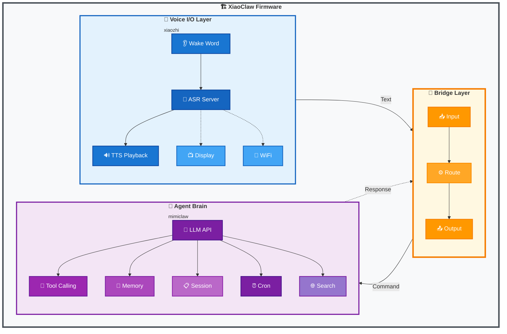
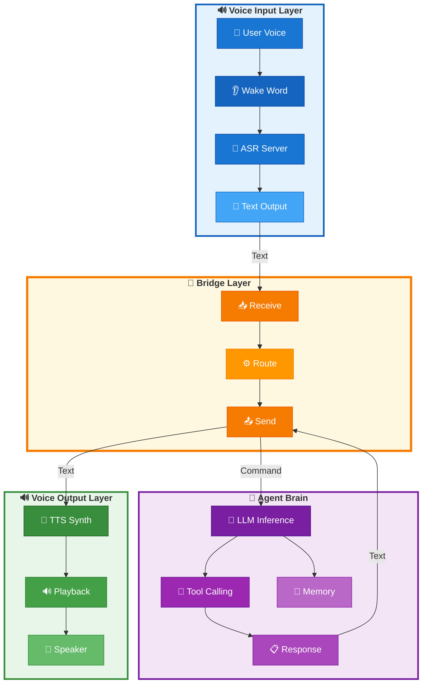
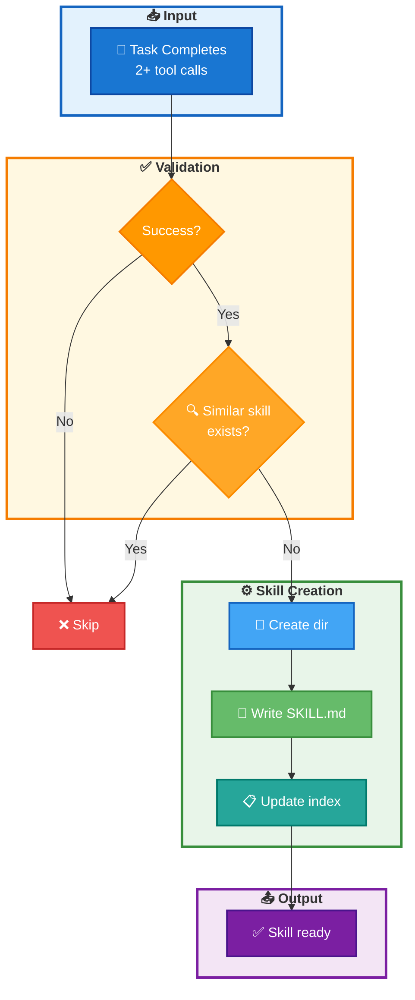
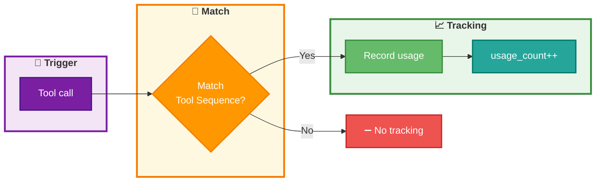

# XiaoClaw: AI Voice Assistant with Local Agent Brain

<p align="center">
  <strong>ESP32-S3 AI Voice Assistant — Voice I/O + Local LLM Agent</strong>
</p>

<p align="center">
  🌐 <a href="https://beancookie.github.io/xiaoclaw/"><strong>Official Website</strong></a>
</p>

<p align="center">
  <a href="LICENSE"></a>
  <a href="https://github.com/anthropics/claude-code"></a>
  <a href="https://beancookie.github.io/xiaoclaw/"></a>
</p>

---

## Introduction

**XiaoClaw** is a unified ESP32-S3 firmware that combines voice interaction with a local AI Agent brain. It integrates:

- **xiaozhi-esp32** — Voice I/O layer: audio recording, playback, wake word detection, display, and network communication
- **mimiclaw** — Agent brain: LLM inference, tool calling, memory management, autonomous task execution

**Core Features:**
- Voice I/O with local wake word detection
- Local LLM inference with ReAct agent loop
- **Self-learning**: Multi-step tasks are automatically crystallized into reusable skills
- Skill system with L0-L4 memory hierarchy
- Cron scheduler for autonomous tasks
- MCP client for dynamic remote tools

All running on a single ESP32-S3 chip with 32MB Flash and 8MB PSRAM.



## Features

### Voice I/O Layer (xiaozhi)

- Offline wake word detection ([ESP-SR](https://github.com/espressif/esp-sr))
- Streaming ASR + TTS via server connection
- OPUS audio codec
- OLED / LCD display with emoji support
- Battery and power management
- Multi-language support (Chinese, English, Japanese)
- WebSocket / MQTT protocol support

### Agent Brain Layer (mimiclaw)

- LLM API integration (Anthropic Claude / OpenAI GPT)
- Modular ReAct agent loop with `AgentRunner` execution engine
- Hook system for iteration/tool callbacks (`before_iteration`, `after_iteration`, `on_tool_result`, `before_tool_execute`)
- Checkpoint system for crash recovery
- Context Builder with modular system prompt construction
- Session consolidation with automatic history compression
- Long-term memory (SPIFFS-based)
- Session management with cursor-based history tracking
- Cron scheduler for autonomous tasks
- Web search capability (Tavily / Brave)

## Hardware Requirements

- **ESP32-S3** development board
- **32MB Flash** (minimum 16MB)
- **8MB PSRAM** (Octal PSRAM recommended)
- Audio codec with microphone and speaker
- Optional: LCD/OLED display

### Supported Boards

XiaoClaw inherits board support from xiaozhi-esp32, including:

- ESP32-S3-BOX3
- M5Stack CoreS3 / AtomS3R
- LiChuang ESP32-S3 Development Board
- LILYGO T-Circle-S3
- And 70+ more boards...

## Quick Start

### Prerequisites

- ESP-IDF v5.5 or later
- Python 3.10+
- CMake 3.16+

### Build

```bash
# Clone the repository
git clone https://github.com/your-repo/xiaoclaw.git
cd xiaoclaw

# Set target
idf.py set-target esp32s3

# Configure (optional)
idf.py menuconfig

# Build
idf.py build
```

### Flash

```bash
# Flash and monitor
idf.py -p PORT flash monitor

# Flash app only (skip SPIFFS to preserve data)
esptool.py -p PORT write_flash 0x20000 ./build/xiaozhi.bin
```

### Configuration

Configure via `idf.py menuconfig` under **Xiaozhi Assistant → Secret Configuration**:

| Option | Description |
|--------|-------------|
| `CONFIG_MIMI_SECRET_WIFI_SSID` | WiFi network name |
| `CONFIG_MIMI_SECRET_WIFI_PASS` | WiFi password |
| `CONFIG_MIMI_SECRET_API_KEY` | LLM API key |
| `CONFIG_MIMI_SECRET_MODEL_PROVIDER` | Model provider: `anthropic` or `openai` |
| `CONFIG_MIMI_SECRET_MODEL` | Model name (e.g., `MiniMax-M2.5`, `claude-opus-4-5`) |
| `CONFIG_MIMI_SECRET_OPENAI_API_URL` | OpenAI compatible API URL |
| `CONFIG_MIMI_SECRET_ANTHROPIC_API_URL` | Anthropic API URL (optional) |
| `CONFIG_MIMI_SECRET_SEARCH_KEY` | Brave Search API key (optional) |
| `CONFIG_MIMI_SECRET_TAVILY_KEY` | Tavily Search API key (optional) |

**Example: Alibaba Cloud Coding+ (通义灵码)**:

```
CONFIG_MIMI_SECRET_MODEL_PROVIDER="openai"
CONFIG_MIMI_SECRET_MODEL="MiniMax-M2.5"
CONFIG_MIMI_SECRET_OPENAI_API_URL="https://coding.dashscope.aliyuncs.com/v1/chat/completions"
CONFIG_MIMI_SECRET_API_KEY="your-api-key"
```

## Architecture

### Bridge Layer

The bridge layer connects the voice I/O layer with the agent brain:



### Memory Layout

| Partition | Size  | Purpose                        |
| --------- | ----- | ------------------------------ |
| nvs       | 32KB  | Non-volatile storage           |
| otadata   | 8KB   | OTA data                       |
| phy_init  | 4KB   | Physical init data             |
| ota_0     | 5MB   | Main firmware                  |
| ota_1     | 5MB   | OTA backup                     |
| assets    | 5MB   | Model assets (wake word, etc.) |
| model     | 5MB   | AI model storage               |
| fatfs     | ~12MB | Memory, sessions, skills       |

### Task Layout

| Task       | Core | Priority | Stack | Function           |
| ---------- | ---- | -------- | ----- | ------------------ |
| agent_loop | 1    | 6        | 24KB  | LLM processing     |
| tg_poll    | 0    | 5        | 12KB  | Telegram bot       |
| feishu_ws  | 0    | 5        | 12KB  | Feishu bot         |
| cron       | any  | 4        | 8KB   | Cron scheduler     |

## Tools

The agent can use various tools:

| Tool                    | Description                            |
| ----------------------- | -------------------------------------- |
| `web_search`            | Search the web for current information |
| `get_datetime`          | Get current date/time                  |
| `get_unix_timestamp`    | Get current unix timestamp             |
| `lua_eval`              | Execute a Lua code string directly     |
| `lua_run`               | Execute a Lua script from FATFS       |
| `mcp_connect`           | Connect to an MCP server               |
| `mcp_disconnect`        | Disconnect from MCP server             |
| `mcp_server.tools_list` | List available remote tools            |
| `mcp_server.tools_call` | Call a remote tool by name             |
| `cron_add`              | Schedule a task                        |
| `cron_list`             | List scheduled tasks                   |
| `cron_remove`           | Remove a scheduled task                |
| `read_file`             | Read file from FATFS                  |
| `write_file`            | Write file to FATFS                   |
| `edit_file`             | Edit file (find-and-replace)           |
| `list_dir`              | List files in directory                |

### MCP Client (Dynamic Remote Tools)

XiaoClaw supports connecting to remote MCP servers to dynamically discover and call tools.

**Configuration:**
- **Kconfig** (recommended): Set `CONFIG_MIMI_MCP_REMOTE_HOST`, `CONFIG_MIMI_MCP_REMOTE_PORT`, etc. in `main/Kconfig.projbuild`
- **SKILL.md** (legacy fallback): `/fatfs/skills/mcp-servers/SKILL.md`

**Kconfig Options:**
| Option | Description | Default |
|--------|-------------|---------|
| `CONFIG_MIMI_MCP_CLIENT_ENABLE` | Enable MCP client | n |
| `CONFIG_MIMI_MCP_REMOTE_HOST` | Server hostname/IP | "" |
| `CONFIG_MIMI_MCP_REMOTE_PORT` | Server port | 8080 |
| `CONFIG_MIMI_MCP_REMOTE_EP` | HTTP endpoint name | mcp_server |
| `CONFIG_MIMI_MCP_TIMEOUT_MS` | Tool call timeout | 10000 |

**Available tools:**
| Tool | Description |
|------|-------------|
| `mcp_connect` | Connect to an MCP server by name |
| `mcp_disconnect` | Disconnect from current server |
| `mcp_server.tools_list` | List available remote tools |
| `mcp_server.tools_call` | Call a remote tool by name |

**Python MCP Server Example:** `scripts/mcp_server.py`

```bash
pip install "mcp[cli]"
python scripts/mcp_server.py --port 8000
```

Remote tools are registered with the actual tool names after connection.

**mcp-servers SKILL.md** (`/fatfs/skills/mcp-servers/SKILL.md`):
```yaml
---
name: mcp-servers
description: Connect to MCP servers and use remote tools
always: true
---
```

**How it works:**
1. Configure server via Kconfig or SKILL.md
2. Use `mcp_connect` with `{"server_name": "default"}` to connect
3. Use `mcp_server.tools_list` to discover available tools
4. Use `mcp_server.tools_call` to execute remote tools

### Lua Scripting

XiaoClaw supports Lua scripting for custom logic and HTTP requests. Scripts are stored in `/fatfs/lua/` directory.

**Built-in functions:**
| Function | Description |
|----------|-------------|
| `print(...)` | Print output to log |
| `http_get(url)` | HTTP GET request, returns `response, status` |
| `http_post(url, body, content_type)` | HTTP POST request |
| `http_put(url, body, content_type)` | HTTP PUT request |
| `http_delete(url)` | HTTP DELETE request |

**Example script:** `/fatfs/lua/hello.lua`

```lua
local greeting = "Hello from Lua!"
local timestamp = os.time()
return string.format("%s (timestamp: %d)", greeting, timestamp)
```

**Example HTTP script:** `/fatfs/lua/http_example.lua`

```lua
local response, status = http_get("https://example.com")
print("Status:", status)
print("Response:", response)
```

Scripts can return values which are serialized as JSON and returned to the agent.

## Memory System

XiaoClaw stores data in plain text files on FATFS with session consolidation support:

| Path | Purpose |
|------|---------|
| `/fatfs/config/SOUL.md` | AI personality |
| `/fatfs/config/USER.md` | User info |
| `/fatfs/memory/MEMORY.md` | Long-term memory (L2) |
| `/fatfs/memory/skill_index.json` | Skill index (L1) |
| `/fatfs/skills/auto/` | Auto-crystallized skills (L3) |
| `/fatfs/sessions/` | Sessions + archive (L4) |

### Memory Hierarchy (L0-L4)

| Layer | Content | Storage | Notes |
| L0 | System constraints | Hardcoded | Base rules |
| L1 | Skill index | skill_index.json | Auto-updated |
| L2 | User facts | MEMORY.md | Long-term |
| L3 | Auto-skills | /skills/auto/ | All available |
| L4 | Archives | /sessions/ | Summarized |

### Session Management

- **Cursor-based tracking**: Each session tracks read position via cursor for efficient history traversal
- **Consolidation**: When session exceeds `max_history` (default: 50) messages, oldest `consolidate_batch` (default: 20) messages are archived to `/fatfs/sessions/`
- **LRU cache**: Active sessions cached in memory (max 8 sessions) for fast access
- **Checkpoint recovery**: Agent can resume from last checkpoint on crash

### Skills System

Skills are loaded from `/fatfs/skills/` directory with YAML frontmatter support.

**Directory Structure:**
```
/fatfs/skills/
├── lua-scripts/SKILL.md      # Manual skill
├── mcp-servers/SKILL.md      # Manual skill (always=true)
└── auto/                     # Auto-crystallized skills
    └── auto_<name>_<hash>/SKILL.md
```

#### Skill Index (L1)

Skill metadata is stored in `/fatfs/memory/skill_index.json`:

```json
{
  "skills": [
    {
      "name": "auto_light_ctrl_a3f2_7d2e",
      "path": "/fatfs/skills/auto/auto_light_ctrl_a3f2_7d2e/SKILL.md",
      "usage_count": 5,
      "success_rate": 0.8,
      "last_used": 1745678901
    }
  ],
  "last_updated": 1745678901
}
```

| Field | Description |
|-------|-------------|
| `name` | Skill identifier |
| `path` | Full path to SKILL.md |
| `usage_count` | Number of times used |
| `success_rate` | Calculated success rate |
| `last_used` | Unix timestamp of last use |

#### Auto-Crystallization (L3)

When a multi-step task succeeds, the system automatically creates a skill.

**Crystallization Conditions:**
- Task completed successfully
- At least 2 tool calls required
- No similar auto-skill exists

**Creation Process:**
1. Task ends successfully with 2+ tool calls
2. `learning_hook_on_task_end()` triggers crystallization
3. Creates `/fatfs/skills/auto/auto_<intent>_<hash>/SKILL.md`
4. Adds entry to `skill_index.json`



**Auto-Skills:**
- All auto-skills in `/fatfs/skills/auto/` are available for use
- Auto-skills with higher usage_count are more frequently used
- Skills can be invoked by matching their Tool Sequence



Note: When a tool call matches an auto-skill's Tool Sequence pattern, that skill's usage_count is incremented.

#### Frontmatter Format

**Manual Skills:**
```yaml
---
name: skill-name
description: Brief description of what the skill does
always: false  # true = always injected into system prompt
---
# Skill Content
...
```

**Auto-Crystallized Skills:**
```yaml
---
name: auto_light_ctrl_a3f2_7d2e
description: Auto-generated skill for: turn on the bedroom light
always: false
auto: true
created_from: 3 tool calls
step_count: 3
success_rate: 1.0
---

# Auto Skill: auto_light_ctrl_a3f2_7d2e

## Intent
turn on the bedroom light

## Tool Sequence
1. tool_name({"arg": "value"})
2. another_tool({"arg": "value"})

## Pitfalls
- Auto-generated from multi-step task execution
```

#### Memory Integration (L1-L3)

| Layer | Content | Storage | Notes |
|-------|---------|---------|-------|
| L1 | Skill index | skill_index.json | All skills metadata |
| L3 | Auto-skills | /skills/auto/ | All auto skills available |

**In System Prompt:**
- **L1**: Skill index shown as "Available Skills" (names only)
- **L3**: All auto-skills full content available
- **Always**: Skills with `always: true` always injected

## Development

### Project Structure

```
xiaoclaw/
├── main/
│   ├── mimi/                  # Agent brain (from mimiclaw)
│   │   ├── agent/            # Agent loop, runner, hooks, checkpoint
│   │   │   ├── agent_loop.c      # Main agent task loop
│   │   │   ├── runner.c          # ReAct execution engine
│   │   │   ├── context_builder.c # System prompt construction
│   │   │   ├── hook.c            # Agent hooks implementation
│   │   │   ├── learning_hooks.c  # Auto-learning/crystallization hooks
│   │   │   └── checkpoint.c       # Crash recovery checkpoint
│   │   ├── bus/              # Message bus
│   │   ├── channels/         # Telegram, Feishu bot integrations
│   │   │   ├── telegram/
│   │   │   └── feishu/
│   │   ├── cron/             # Cron scheduler service
│   │   ├── gateway/          # WebSocket server
│   │   ├── heartbeat/        # Autonomous task heartbeat
│   │   ├── llm/              # LLM proxy
│   │   ├── memory/           # Memory store, session manager, consolidator
│   │   │   ├── memory_store.c    # Long-term memory
│   │   │   ├── session_manager.c # Session with cursor/consolidation
│   │   │   ├── consolidator.c    # Automatic history compression
│   │   │   └── hierarchy.c       # Memory hierarchy management
│   │   ├── ota/              # OTA updates
│   │   ├── proxy/            # HTTP proxy
│   │   ├── skills/           # Skill loader
│   │   │   ├── skill_loader.c     # Skill loading (frontmatter)
│   │   │   ├── skill_meta.c       # Skill metadata
│   │   │   └── skill_crystallize.c # Auto-crystallization
│   │   ├── tools/            # Tool registry
│   │   │   ├── tool_registry.c    # Tool registration
│   │   │   ├── tool_cron.c        # Cron tools
│   │   │   ├── tool_files.c       # File operation tools
│   │   │   ├── tool_get_time.c    # Time tools
│   │   │   ├── tool_lua.c         # Lua execution tool
│   │   │   ├── tool_mcp_client.c  # MCP client tool
│   │   │   └── tool_web_search.c  # Web search tool
│   │   ├── util/             # Utilities
│   │   │   └── fatfs_util.c
│   │   ├── mimi.c/h          # Module entry
│   │   ├── mimi_config.h     # Configuration
│   │   └── mimi_secrets.h    # Secret keys
│   ├── audio/                # Voice I/O (from xiaozhi)
│   │   ├── audio_codec.cc/h
│   │   ├── audio_service.cc/h
│   │   ├── codecs/           # Audio codecs
│   │   ├── demuxer/          # Audio demuxer
│   │   ├── processors/        # Audio processors (AFE, etc.)
│   │   └── wake_words/        # Wake word detection
│   ├── bridge/               # Bridge layer (voice ↔ Agent)
│   ├── display/              # Display drivers
│   │   ├── display.cc/h
│   │   ├── lcd_display.cc/h
│   │   ├── oled_display.cc/h
│   │   ├── emote_display.cc/h
│   │   └── lvgl_display/     # LVGL graphics
│   ├── protocols/            # Communication protocols
│   │   ├── websocket_protocol.cc/h
│   │   └── mqtt_protocol.cc/h
│   ├── boards/               # Board support (70+ board configs)
│   │   ├── common/          # Common components
│   │   └── <board-name>/    # Per-board configs
│   ├── led/                 # LED control
│   ├── application.cc/h     # Main application entry
│   ├── device_state.h       # Device state
│   ├── device_state_machine.cc/h # State machine
│   ├── main.cc              # Entry point
│   ├── mcp_server.cc/h      # MCP server
│   ├── ota.cc/h             # OTA updates
│   ├── settings.cc/h         # Settings management
│   ├── system_info.cc/h      # System info
│   ├── assets.cc/h           # Assets management
│   └── idf_component.yml     # Component manifest
├── fatfs_data/               # FATFS content (flashed to /fatfs partition)
│   ├── config/
│   │   ├── SOUL.md          # AI personality definition
│   │   └── USER.md          # User information
│   ├── lua/                  # Lua scripts
│   │   ├── hello.lua
│   │   └── http_example.lua
│   ├── memory/
│   │   ├── MEMORY.md        # Long-term memory
│   │   ├── facts.json       # Facts database
│   │   └── skill_index.json # Skill index
│   ├── skills/               # Skills directory
│   │   ├── lua-scripts/
│   │   └── mcp-servers/
│   ├── HEARTBEAT.md          # Runtime heartbeat tasks
│   └── cron.json             # Cron jobs configuration
├── CMakeLists.txt
└── sdkconfig.defaults.esp32s3
```

## Related Projects

XiaoClaw is built upon these excellent projects:

- [xiaozhi-esp32](https://github.com/78/xiaozhi-esp32) — Voice interaction framework
- [mimiclaw](https://github.com/memovai/mimiclaw) — ESP32 AI agent

## License

MIT License

## Acknowledgments

- xiaozhi-esp32 team for the voice interaction framework
- mimiclaw team for the embedded AI agent architecture
- Espressif for ESP-IDF and ESP-SR
