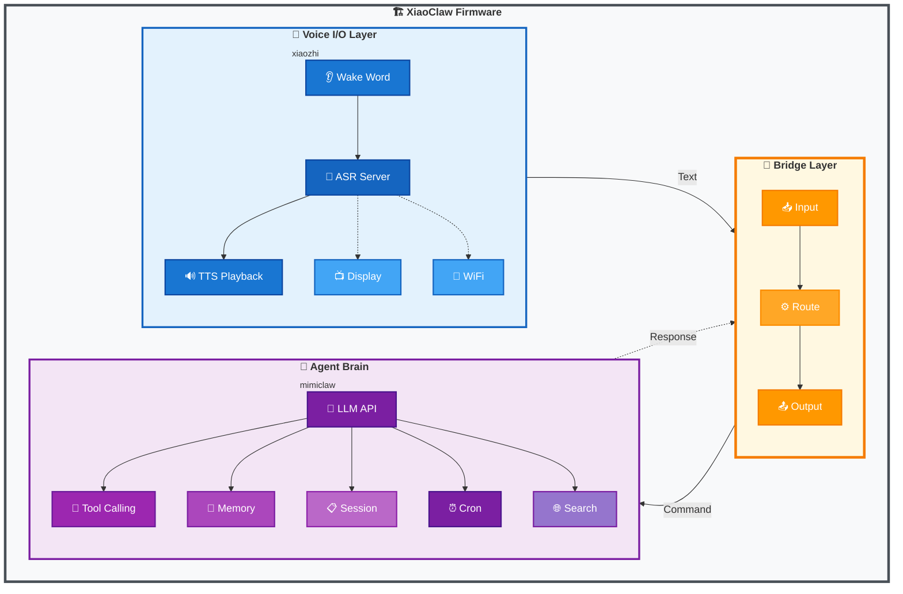
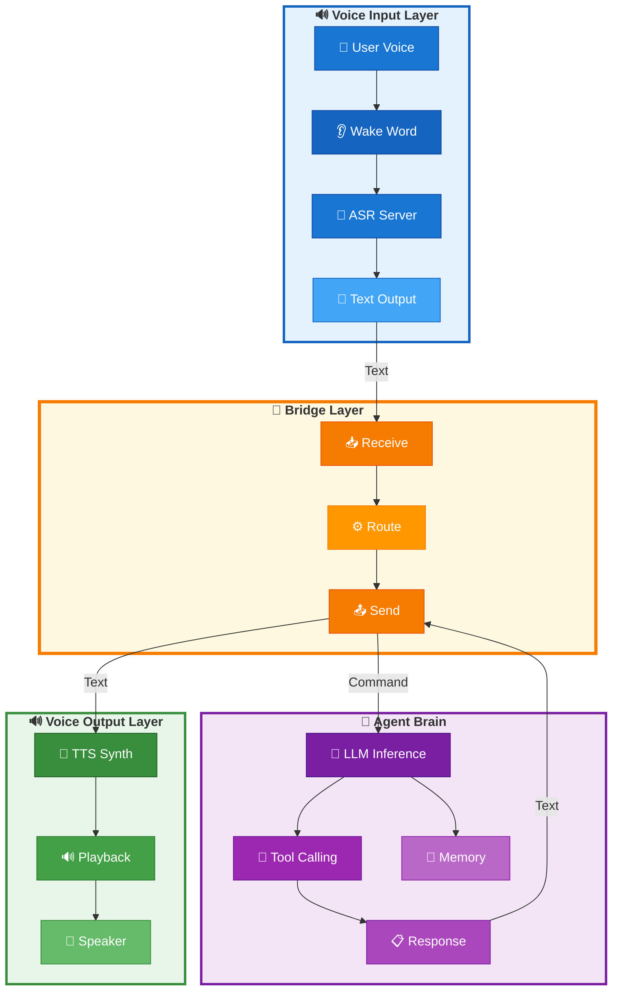

# XiaoClaw: AI Voice Assistant with Local Agent Brain

<p align="center">
  <strong>ESP32-S3 AI Voice Assistant — Voice I/O + Local LLM Agent</strong>
</p>

<p align="center">
  🌐 <a href="https://beancookie.github.io/xiaoclaw/"><strong>Official Website</strong></a>
</p>

<p align="center">
  <a href="LICENSE"></a>
  <a href="https://github.com/anthropics/claude-code"></a>
  <a href="https://beancookie.github.io/xiaoclaw/"></a>
</p>

---

## Introduction

**XiaoClaw** is a unified ESP32-S3 firmware that combines voice interaction with a local AI agent brain. It integrates:

- **xiaozhi-esp32** — Voice I/O layer: audio recording, playback, wake word detection, display, and network communication
- **mimiclaw** — Agent brain: LLM-powered reasoning, tool calling, memory management, and autonomous task execution

All running on a single ESP32-S3 chip with 32MB Flash and 8MB PSRAM.



## Features

### Voice I/O Layer (xiaozhi)

- Offline wake word detection ([ESP-SR](https://github.com/espressif/esp-sr))
- Streaming ASR + TTS via server connection
- OPUS audio codec
- OLED / LCD display with emoji support
- Battery and power management
- Multi-language support (Chinese, English, Japanese)
- WebSocket / MQTT protocol support

### Agent Brain Layer (mimiclaw)

- LLM API integration (Anthropic Claude / OpenAI GPT)
- Modular ReAct agent loop with `AgentRunner` execution engine
- Hook system for iteration/tool callbacks (`before_iteration`, `after_iteration`, `on_tool_result`, `before_tool_execute`)
- Checkpoint system for crash recovery
- Context Builder with modular system prompt construction
- Session consolidation with automatic history compression
- Long-term memory (SPIFFS-based)
- Session management with cursor-based history tracking
- Cron scheduler for autonomous tasks
- Web search capability (Tavily / Brave)

## Hardware Requirements

- **ESP32-S3** development board
- **32MB Flash** (minimum 16MB)
- **8MB PSRAM** (Octal PSRAM recommended)
- Audio codec with microphone and speaker
- Optional: LCD/OLED display

### Supported Boards

XiaoClaw inherits board support from xiaozhi-esp32, including:

- ESP32-S3-BOX3
- M5Stack CoreS3 / AtomS3R
- LiChuang ESP32-S3 Development Board
- LILYGO T-Circle-S3
- And 70+ more boards...

## Quick Start

### Prerequisites

- ESP-IDF v5.5 or later
- Python 3.10+
- CMake 3.16+

### Build

```bash
# Clone the repository
git clone https://github.com/your-repo/xiaoclaw.git
cd xiaoclaw

# Set target
idf.py set-target esp32s3

# Configure (optional)
idf.py menuconfig

# Build
idf.py build
```

### Flash

```bash
# Flash and monitor
idf.py -p PORT flash monitor

# Flash app only (skip SPIFFS to preserve data)
esptool.py -p PORT write_flash 0x20000 ./build/xiaozhi.bin
```

### Configuration

Create `main/mimi/mimi_secrets.h` from the example:

```c
#define MIMI_SECRET_WIFI_SSID       "YourWiFiName"
#define MIMI_SECRET_WIFI_PASS       "YourWiFiPassword"
#define MIMI_SECRET_API_KEY         "sk-ant-api03-xxxxx"
#define MIMI_SECRET_MODEL_PROVIDER  "anthropic"  // or "openai"
```

## Architecture

### Bridge Layer

The bridge layer connects the voice I/O layer with the agent brain:



### Memory Layout

| Partition | Size  | Purpose                        |
| --------- | ----- | ------------------------------ |
| nvs       | 32KB  | Non-volatile storage           |
| otadata   | 8KB   | OTA data                       |
| phy_init  | 4KB   | Physical init data             |
| ota_0     | 5MB   | Main firmware                  |
| ota_1     | 5MB   | OTA backup                     |
| assets    | 7MB   | Model assets (wake word, etc.) |
| model     | 1MB   | AI model storage               |
| spiffs    | ~14MB | Memory, sessions, skills       |

### Task Layout

| Task       | Core | Priority | Function             |
| ---------- | ---- | -------- | -------------------- |
| audio\_\*  | 0    | 8        | Audio I/O            |
| main_loop  | 0    | 5        | Application main     |
| bridge     | 0    | 5        | Bridge communication |
| agent_loop | 1    | 6        | LLM processing       |

## Tools

The agent can use various tools:

| Tool               | Description                            |
| ------------------ | -------------------------------------- |
| `web_search`       | Search the web for current information |
| `get_current_time` | Get current date/time                  |
| `gpio_write`       | Control GPIO pins                      |
| `gpio_read`        | Read GPIO state                        |
| `gpio_read_all`    | Read all allowed GPIO pins             |
| `lua_eval`         | Execute a Lua code string directly     |
| `lua_run`          | Execute a Lua script from SPIFFS       |
| `mcp_connect`      | Connect to an MCP server               |
| `mcp_disconnect`   | Disconnect from MCP server             |
| `cron_add`         | Schedule a task                        |
| `cron_list`        | List scheduled tasks                   |
| `cron_remove`      | Remove a scheduled task                |
| `read_file`        | Read file from SPIFFS                  |
| `write_file`       | Write file to SPIFFS                   |
| `edit_file`        | Edit file (find-and-replace)           |
| `list_dir`         | List files in directory                |

**Note:** GPIO tools respect board-specific policies defined in `gpio_policy.h`.

### MCP Client (Dynamic Remote Tools)

XiaoClaw supports connecting to remote MCP servers to dynamically discover and call tools. Server configurations are stored in `mcp-servers.md` skill file.

**Configuration file:** `/spiffs/skills/mcp-servers.md`

```markdown
# MCP Servers

## my_server

- host: 192.168.1.100
- port: 8000
- endpoint: mcp
```

**Available tools:**
| Tool | Description |
|------|-------------|
| `mcp_connect` | Connect to an MCP server by name |
| `mcp_disconnect` | Disconnect from current server |

**Python MCP Server Example:** `scripts/mcp_server.py`

```bash
pip install "mcp[cli]"
python scripts/mcp_server.py --port 8000
```

Remote tools are registered with the `{server_name}.` prefix (e.g., `my_server.get_device_status`), distinguishing them from local tools.

### Lua Scripting

XiaoClaw supports Lua scripting for custom logic and HTTP requests. Scripts are stored in `/spiffs/lua/` directory.

**Built-in functions:**
| Function | Description |
|----------|-------------|
| `print(...)` | Print output to log |
| `http_get(url)` | HTTP GET request, returns `response, status` |
| `http_post(url, body, content_type)` | HTTP POST request |
| `http_put(url, body, content_type)` | HTTP PUT request |
| `http_delete(url)` | HTTP DELETE request |

**Example script:** `/spiffs/lua/hello.lua`

```lua
local greeting = "Hello from Lua!"
local timestamp = os.time()
return string.format("%s (timestamp: %d)", greeting, timestamp)
```

**Example HTTP script:** `/spiffs/lua/http_example.lua`

```lua
local response, status = http_get("https://example.com")
print("Status:", status)
print("Response:", response)
```

Scripts can return values which are serialized as JSON and returned to the agent.

## Memory System

XiaoClaw stores data in plain text files on SPIFFS with session consolidation support:

| Path                           | Purpose                                       |
| ------------------------------ | --------------------------------------------- |
| `/spiffs/config/SOUL.md`       | AI personality definition                     |
| `/spiffs/config/USER.md`       | User information and preferences              |
| `/spiffs/memory/MEMORY.md`     | Long-term memory                              |
| `/spiffs/HEARTBEAT.md`         | Autonomous task list (runtime)                |
| `/spiffs/cron.json`            | Scheduled jobs (runtime)                      |
| `/spiffs/sessions/tg_*.jsonl`  | Conversation history (JSONL format)           |
| `/spiffs/sessions/tg_*.meta`   | Session metadata (cursor, consolidated count) |
| `/spiffs/archive/tg_*.archive` | Archived old messages                         |

### Session Management

- **Cursor-based tracking**: Each session tracks read position via cursor for efficient history traversal
- **Consolidation**: When session exceeds `max_history` (default: 50) messages, oldest `consolidate_batch` (default: 20) messages are archived to `/spiffs/archive/`
- **LRU cache**: Active sessions cached in memory (max 8 sessions) for fast access
- **Checkpoint recovery**: Agent can resume from last checkpoint on crash

### Skills System

Skills are loaded from `/spiffs/skills/` directory with YAML frontmatter support. Each skill is a directory containing a `SKILL.md` file:

```
/spiffs/skills/
├── weather/
│   └── SKILL.md
├── get-time/
│   └── SKILL.md
└── lua-scripts/
    └── SKILL.md
```

**Frontmatter format:**

```yaml
---
name: weather
description: Get current weather and forecasts
always: false
---
# Weather Skill
...
```

- **`name`**: Skill identifier used by the agent
- **`description`**: Brief description of what the skill does
- **`always: true`**: Skill content always injected into system prompt
- **`requires.bins`**: CLI tools required by the skill (optional)
- **`requires.env`**: Environment variables needed (optional)

**Skill file format:**

- `SKILL.md` - Contains skill description, usage instructions, and examples
- Tool definitions in the format: `Tool: tool_name\nInput: {json}`

## Development

### Project Structure

```
xiaoclaw/
├── main/
│   ├── mimi/             # Agent brain (from mimiclaw)
│   │   ├── agent/        # Agent loop, runner, hooks, checkpoint
│   │   │   ├── agent_loop.c   # Main agent task loop
│   │   │   ├── runner.c       # ReAct execution engine
│   │   │   ├── context_builder.c # System prompt construction
│   │   │   ├── hook.c         # Agent hooks implementation
│   │   │   └── checkpoint.c   # Crash recovery checkpoint
│   │   ├── bus/          # Message bus
│   │   ├── channels/     # Telegram, Feishu bot integrations
│   │   ├── cron/         # Cron scheduler service
│   │   ├── gateway/      # WebSocket server
│   │   ├── heartbeat/    # Autonomous task heartbeat
│   │   ├── llm/          # LLM proxy
│   │   ├── memory/       # Memory store, session manager, consolidator
│   │   │   ├── memory_store.c    # Long-term memory
│   │   │   ├── session_manager.c # Session with cursor/consolidation
│   │   │   └── consolidator.c     # Automatic history compression
│   │   ├── ota/          # OTA updates
│   │   ├── proxy/        # HTTP proxy
│   │   ├── skills/       # Skill loader with frontmatter
│   │   ├── tools/        # Tool registry with concurrency support
│   ├── audio/            # Voice I/O (from xiaozhi)
│   ├── bridge/           # Bridge layer
│   ├── display/
│   ├── protocols/
│   ├── boards/
│   ├── led/              # LED control
│   ├── lua/              # Lua script support
│   ├── memory/           # Memory management
│   ├── skills/           # Skills system
│   ├── assets.cc/h       # Assets management
│   ├── application.cc/h  # Main application
│   ├── device_state.h   # Device state
│   ├── device_state_machine.cc/h # State machine
│   ├── idf_component.yml # Component manifest
│   ├── main.cc           # Entry point
│   ├── mcp_server.cc/h   # MCP server
│   ├── ota.cc/h          # OTA updates
│   ├── settings.cc/h     # Settings management
│   └── system_info.cc/h  # System info
├── spiffs_data/          # SPIFFS content (flashed to /spiffs partition)
│   ├── config/           # SOUL.md, USER.md
│   ├── lua/              # Lua scripts (hello.lua, http_example.lua)
│   ├── memory/            # MEMORY.md
│   └── skills/            # get-time/, lua-scripts/, mcp-servers/, skill-creator/, weather/
├── CMakeLists.txt
└── sdkconfig.defaults.esp32s3
```

## Related Projects

XiaoClaw is built upon these excellent projects:

- [xiaozhi-esp32](https://github.com/78/xiaozhi-esp32) — Voice interaction framework
- [mimiclaw](https://github.com/memovai/mimiclaw) — ESP32 AI agent

## License

MIT License

## Acknowledgments

- xiaozhi-esp32 team for the voice interaction framework
- mimiclaw team for the embedded AI agent architecture
- Espressif for ESP-IDF and ESP-SR
