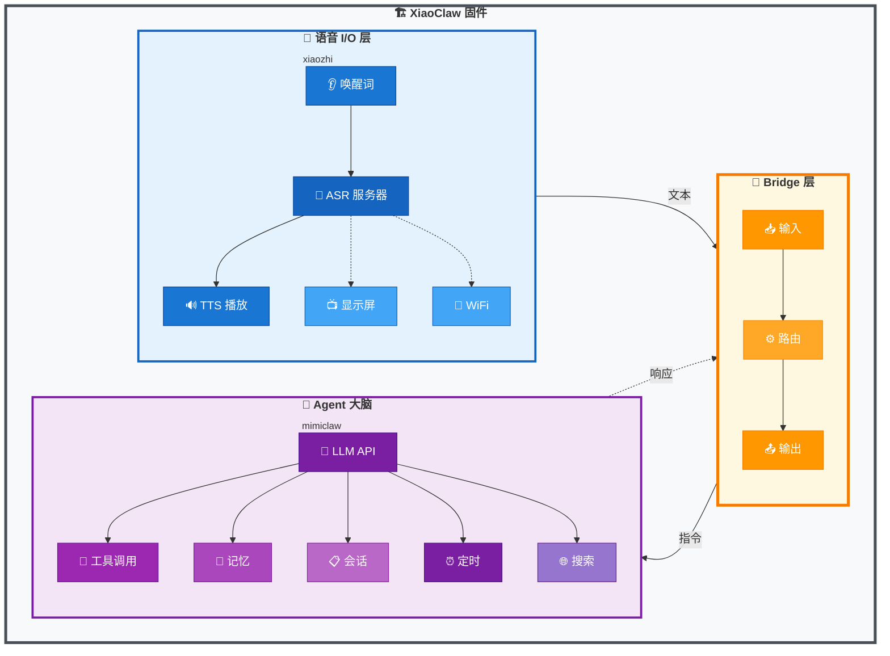
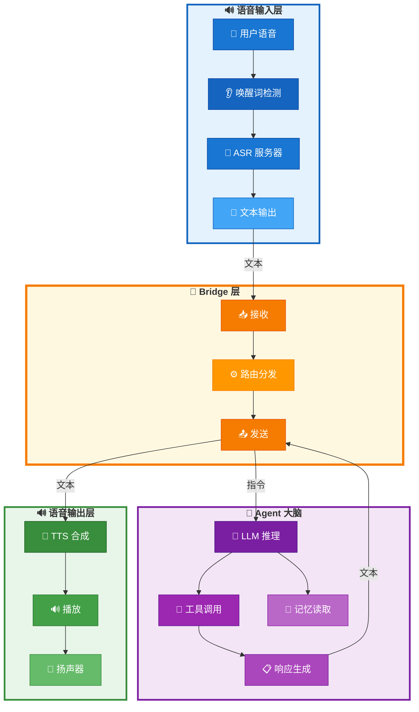

# XiaoClaw: 带本地 Agent 大脑的 AI 语音助手

<p align="center">
  <strong>ESP32-S3 AI 语音助手 — 语音 I/O + 本地 LLM Agent</strong>
</p>

<p align="center">
  🌐 <a href="https://beancookie.github.io/xiaoclaw/"><strong>官方网站</strong></a>
</p>

<p align="center">
  <a href="LICENSE"></a>
  <a href="https://github.com/anthropics/claude-code"></a>
  <a href="https://beancookie.github.io/xiaoclaw/"></a>
</p>

---

## 介绍

**XiaoClaw** 是一个统一的 ESP32-S3 固件，将语音交互与本地 AI Agent 大脑结合在一起。它整合了：

- **xiaozhi-esp32** — 语音 I/O 层：音频录制、播放、唤醒词检测、显示屏、网络通信
- **mimiclaw** — Agent 大脑：LLM 推理、工具调用、记忆管理、自主任务执行

**核心特性：**
- 本地唤醒词检测的语音 I/O
- 本地 LLM 推理，采用 ReAct Agent 循环
- **自我学习**：多步骤任务自动结晶为可复用技能
- L0-L4 记忆层级的技能系统
- 定时任务调度器
- MCP 客户端支持动态远程工具

所有功能运行在单个 ESP32-S3 芯片上，配备 32MB Flash 和 8MB PSRAM。



## 功能特性

### 语音 I/O 层 (xiaozhi)

- 离线语音唤醒 ([ESP-SR](https://github.com/espressif/esp-sr))
- 通过服务器连接实现流式 ASR + TTS
- OPUS 音频编解码
- OLED / LCD 显示屏，支持表情显示
- 电池和电源管理
- 多语言支持（中文、英文、日文）
- WebSocket / MQTT 协议支持

### Agent 大脑层 (mimiclaw)

- LLM API 集成 (Anthropic Claude / OpenAI GPT)
- 模块化 ReAct Agent 循环，`AgentRunner` 执行引擎
- Hook 系统支持迭代/工具回调 (`before_iteration`, `after_iteration`, `on_tool_result`, `before_tool_execute`)
- Checkpoint 系统用于崩溃恢复
- Context Builder 模块化系统 prompt 构建
- Session 合并压缩，自动历史整理
- 长期记忆 (基于 SPIFFS)
- 基于游标的会话历史追踪
- 定时任务调度器
- 网络搜索能力 (Tavily / Brave)

## 硬件要求

- **ESP32-S3** 开发板
- **32MB Flash**（最低 16MB）
- **8MB PSRAM**（推荐 8线 PSRAM）
- 音频编解码器（带麦克风和扬声器）
- 可选：LCD/OLED 显示屏

### 支持的开发板

XiaoClaw 继承了 xiaozhi-esp32 的开发板支持，包括：

- ESP32-S3-BOX3
- M5Stack CoreS3 / AtomS3R
- 立创实战派 ESP32-S3 开发板
- LILYGO T-Circle-S3
- 以及 70+ 更多开发板...

## 快速开始

### 环境准备

- ESP-IDF v5.5 或更高版本
- Python 3.10+
- CMake 3.16+

### 编译

```bash
# 克隆仓库
git clone https://github.com/your-repo/xiaoclaw.git
cd xiaoclaw

# 设置目标芯片
idf.py set-target esp32s3

# 配置（可选）
idf.py menuconfig

# 编译
idf.py build
```

### 烧录

```bash
# 烧录并监控
idf.py -p PORT flash monitor

# 仅烧录 app 分区（跳过 SPIFFS，保留数据）
esptool.py -p PORT write_flash 0x20000 ./build/xiaozhi.bin
```

### 配置

通过 `idf.py menuconfig` 在 **Xiaozhi Assistant → Secret Configuration** 下配置：

| 选项 | 说明 |
|------|------|
| `CONFIG_MIMI_SECRET_WIFI_SSID` | WiFi 名称 |
| `CONFIG_MIMI_SECRET_WIFI_PASS` | WiFi 密码 |
| `CONFIG_MIMI_SECRET_API_KEY` | LLM API 密钥 |
| `CONFIG_MIMI_SECRET_MODEL_PROVIDER` | 模型提供商：`anthropic` 或 `openai` |
| `CONFIG_MIMI_SECRET_MODEL` | 模型名称（如 `MiniMax-M2.5`、`claude-opus-4-5`） |
| `CONFIG_MIMI_SECRET_OPENAI_API_URL` | OpenAI 兼容 API 地址 |
| `CONFIG_MIMI_SECRET_ANTHROPIC_API_URL` | Anthropic API 地址（可选） |

**示例：阿里云通义灵码**:

```
CONFIG_MIMI_SECRET_MODEL_PROVIDER="openai"
CONFIG_MIMI_SECRET_MODEL="MiniMax-M2.5"
CONFIG_MIMI_SECRET_OPENAI_API_URL="https://coding.dashscope.aliyuncs.com/v1/chat/completions"
CONFIG_MIMI_SECRET_API_KEY="your-api-key"
```

## 架构

### Bridge 层

Bridge 层连接语音 I/O 层与 Agent 大脑：



### 内存布局

| 分区     | 大小  | 用途                 |
| -------- | ----- | -------------------- |
| nvs      | 32KB  | 非易失性存储         |
| otadata  | 8KB   | OTA 数据             |
| phy_init | 4KB   | 物理初始化数据       |
| ota_0    | 5MB   | 主固件               |
| ota_1    | 5MB   | OTA 备份             |
| assets   | 5MB   | 模型资源（唤醒词等） |
| model    | 5MB   | AI 模型存储          |
| fatfs    | ~12MB | 记忆、会话、技能     |

### 任务布局

| 任务       | 核心 | 优先级 | 栈大小 | 功能        |
| ---------- | ---- | ------ | ------ | ----------- |
| agent_loop | 1    | 6      | 24KB   | LLM 处理    |
| tg_poll    | 0    | 5      | 12KB   | Telegram 机器人 |
| feishu_ws  | 0    | 5      | 12KB   | 飞书机器人  |
| cron       | any  | 4      | 4KB    | 定时任务    |

## 工具

Agent 可以使用多种工具：

| 工具                    | 描述                    |
| ----------------------- | ----------------------- |
| `web_search`            | 搜索网络获取最新信息    |
| `get_datetime`          | 获取当前日期/时间       |
| `get_unix_timestamp`    | 获取当前 Unix 时间戳    |
| `lua_eval`              | 直接执行 Lua 代码       |
| `lua_run`               | 从 FATFS 执行 Lua 脚本 |
| `mcp_connect`           | 连接 MCP 服务器         |
| `mcp_disconnect`        | 断开 MCP 服务器连接     |
| `mcp_server.tools_list` | 列出可用远程工具        |
| `mcp_server.tools_call` | 调用远程工具            |
| `cron_add`              | 创建定时任务            |
| `cron_list`             | 列出定时任务            |
| `cron_remove`           | 删除定时任务            |
| `read_file`             | 从 FATFS 读取文件      |
| `write_file`            | 写入文件到 FATFS       |
| `edit_file`             | 编辑文件（查找替换）    |
| `list_dir`              | 列出目录中的文件        |

### MCP Client（动态远程工具）

XiaoClaw 支持连接远程 MCP 服务器，动态发现并调用工具。

**配置方式：**
- **Kconfig**（推荐）：在 `main/Kconfig.projbuild` 中设置 `CONFIG_MIMI_MCP_REMOTE_HOST`、`CONFIG_MIMI_MCP_REMOTE_PORT` 等
- **SKILL.md**（legacy fallback）：`/fatfs/skills/mcp-servers/SKILL.md`

**Kconfig 选项：**
| 选项 | 描述 | 默认值 |
|------|------|--------|
| `CONFIG_MIMI_MCP_CLIENT_ENABLE` | 启用 MCP 客户端 | n |
| `CONFIG_MIMI_MCP_REMOTE_HOST` | 服务器主机名/IP | "" |
| `CONFIG_MIMI_MCP_REMOTE_PORT` | 服务器端口 | 8080 |
| `CONFIG_MIMI_MCP_REMOTE_EP` | HTTP 端点名称 | mcp_server |
| `CONFIG_MIMI_MCP_TIMEOUT_MS` | 工具调用超时(ms) | 10000 |

**可用工具：**
| 工具 | 描述 |
|------|------|
| `mcp_connect` | 按名称连接 MCP 服务器 |
| `mcp_disconnect` | 断开当前服务器连接 |
| `mcp_server.tools_list` | 列出可用远程工具 |
| `mcp_server.tools_call` | 调用远程工具 |

**Python MCP 服务器示例：** `scripts/mcp_server.py`

```bash
pip install "mcp[cli]"
python scripts/mcp_server.py --port 8000
```

连接后远程工具以实际名称注册。

**mcp-servers SKILL.md** (`/fatfs/skills/mcp-servers/SKILL.md`)：
```yaml
---
name: mcp-servers
description: Connect to MCP servers and use remote tools
always: true
---
```

**工作流程：**
1. 通过 Kconfig 或 SKILL.md 配置服务器
2. 使用 `mcp_connect` 连接，参数 `{"server_name": "default"}`
3. 使用 `mcp_server.tools_list` 发现可用工具
4. 使用 `mcp_server.tools_call` 执行远程工具

### Lua 脚本

XiaoClaw 支持 Lua 脚本，可用于自定义逻辑和 HTTP 请求。脚本存储在 `/fatfs/lua/` 目录。

**内置函数：**
| 函数 | 描述 |
|------|------|
| `print(...)` | 打印输出到日志 |
| `http_get(url)` | HTTP GET 请求，返回 `response, status` |
| `http_post(url, body, content_type)` | HTTP POST 请求 |
| `http_put(url, body, content_type)` | HTTP PUT 请求 |
| `http_delete(url)` | HTTP DELETE 请求 |

**示例脚本：** `/fatfs/lua/hello.lua`

```lua
local greeting = "Hello from Lua!"
local timestamp = os.time()
return string.format("%s (timestamp: %d)", greeting, timestamp)
```

**HTTP 示例：** `/fatfs/lua/http_example.lua`

```lua
local response, status = http_get("https://example.com")
print("Status:", status)
print("Response:", response)
```

脚本可以返回值，会被序列化为 JSON 返回给 Agent。

## 记忆系统

XiaoClaw 在 FATFS 上以纯文本文件存储数据，支持会话合并压缩：

| 路径 | 用途 |
| `/fatfs/config/SOUL.md` | AI 人格 |
| `/fatfs/config/USER.md` | 用户信息 |
| `/fatfs/memory/MEMORY.md` | 长期记忆 (L2) |
| `/fatfs/memory/skill_index.json` | 技能索引 (L1) |
| `/fatfs/skills/auto/` | 自动结晶技能 (L3) |
| `/fatfs/sessions/` | 会话 + 归档 (L4) |

### 记忆层级 (L0-L4)

| 层级 | 内容 | 存储 | 备注 |
| L0 | 系统约束 | 硬编码 | 基础规则 |
| L1 | 技能索引 | skill_index.json | 自动更新 |
| L2 | 用户事实 | MEMORY.md | 长期 |
| L3 | 热门自动技能 | /skills/auto/ | usage>=3 |
| L4 | 归档 | /sessions/ | 已摘要 |

### 会话管理

- **游标追踪**: 每个会话通过游标跟踪已读取位置，高效遍历历史
- **合并压缩**: 当会话超过 `max_history`（默认 50）条消息时，最旧 `consolidate_batch`（默认 20）条消息归档到 `/fatfs/sessions/`
- **LRU 缓存**: 活跃会话缓存在内存中（最多 8 个会话）快速访问
- **检查点恢复**: Agent 崩溃后可从上一个检查点恢复

### Skills 系统

Skills 从 `/fatfs/skills/` 目录加载，支持 YAML frontmatter。

**目录结构：**
```
/fatfs/skills/
├── lua-scripts/SKILL.md      # 手动技能
├── mcp-servers/SKILL.md      # 手动技能 (always=true)
├── skill-creator/SKILL.md    # 手动技能
└── auto/                     # 自动结晶技能
    └── auto_<name>_<hash>/SKILL.md
```

#### 技能索引 (L1)

技能元数据存储在 `/fatfs/memory/skill_index.json`：

```json
{
  "skills": [
    {
      "name": "auto_light_ctrl_a3f2_7d2e",
      "path": "/fatfs/skills/auto/auto_light_ctrl_a3f2_7d2e/SKILL.md",
      "is_auto": true,
      "usage_count": 5,
      "success_rate": 0.8,
      "last_used": 1745678901,
      "is_hot": true
    }
  ],
  "hot_threshold": 3
}
```

| 字段 | 描述 |
|------|------|
| `name` | 技能标识符 |
| `path` | SKILL.md 完整路径 |
| `is_auto` | 自动结晶技能为 true |
| `usage_count` | 使用次数 |
| `success_rate` | success_count / usage_count |
| `is_hot` | usage_count >= 3 时为 true |

#### 自动结晶 (L3)

当多步骤任务成功完成时，系统自动创建技能。

**结晶条件：**
- 任务成功完成
- 至少 2 次工具调用
- 不存在相似技能

**创建流程：**
1. 任务成功结束且有 2+ 次工具调用
2. `learning_hook_on_task_end()` 触发结晶
3. 创建 `/fatfs/skills/auto/auto_<intent>_<hash>/SKILL.md`
4. 添加条目到 `skill_index.json`

**热门技能：**
- `usage_count >= 3` 的技能标记为 `is_hot=true`
- 热门自动技能完整内容注入 system prompt (L3)

#### Frontmatter 格式

**手动技能：**
```yaml
---
name: skill-name
description: 技能功能简要描述
always: false  # true = 始终注入 system prompt
---
# 技能内容
...
```

**自动结晶技能：**
```yaml
---
name: auto_light_ctrl_a3f2_7d2e
description: Auto-generated skill for: turn on the bedroom light
always: false
auto: true
created_from: 3 tool calls
step_count: 3
success_rate: 1.0
---

# Auto Skill: auto_light_ctrl_a3f2_7d2e

## Intent
turn on the bedroom light

## Tool Sequence
1. tool_name({"arg": "value"})
2. another_tool({"arg": "value"})

## Pitfalls
- Auto-generated from multi-step task execution
```

#### 记忆集成 (L1-L3)

| 层 | 内容 | 存储 | 说明 |
|----|------|------|------|
| L1 | 技能索引 | skill_index.json | 所有技能元数据 |
| L3 | 热门自动技能 | /skills/auto/ | usage>=3, 完整内容 |

**System Prompt 中的内容：**
- **L1**: 技能索引显示为 "Available Skills"（仅名称）
- **L3**: 热门自动技能 (is_hot=true) 完整内容注入
- **Always**: `always: true` 的技能始终注入

## 开发

### 项目结构

```
xiaoclaw/
├── main/
│   ├── mimi/                  # Agent 大脑（来自 mimiclaw）
│   │   ├── agent/            # Agent 循环、runner、hooks、checkpoint
│   │   │   ├── agent_loop.c      # Agent 主任务循环
│   │   │   ├── runner.c          # ReAct 执行引擎
│   │   │   ├── context_builder.c # 系统 prompt 构建
│   │   │   ├── hook.c            # Agent hooks 实现
│   │   │   ├── learning_hooks.c  # 自动学习/结晶 hooks
│   │   │   └── checkpoint.c       # 崩溃恢复检查点
│   │   ├── bus/              # 消息总线
│   │   ├── channels/         # Telegram、飞书机器人集成
│   │   │   ├── telegram/
│   │   │   └── feishu/
│   │   ├── cron/             # Cron 调度器服务
│   │   ├── gateway/          # WebSocket 服务器
│   │   ├── heartbeat/        # 自主任务心跳
│   │   ├── llm/              # LLM 代理
│   │   ├── memory/           # 记忆存储、会话管理器、合并器
│   │   │   ├── memory_store.c    # 长期记忆
│   │   │   ├── session_manager.c # 带游标/合并的会话
│   │   │   ├── consolidator.c    # 自动历史压缩
│   │   │   └── hierarchy.c       # 记忆层级管理
│   │   ├── ota/              # OTA 更新
│   │   ├── proxy/            # HTTP 代理
│   │   ├── skills/           # 技能加载器
│   │   │   ├── skill_loader.c     # 技能加载（frontmatter）
│   │   │   ├── skill_meta.c       # 技能元数据
│   │   │   └── skill_crystallize.c # 自动结晶
│   │   ├── tools/            # 工具注册表
│   │   │   ├── tool_registry.c    # 工具注册
│   │   │   ├── tool_cron.c        # Cron 工具
│   │   │   ├── tool_files.c       # 文件操作工具
│   │   │   ├── tool_get_time.c    # 时间工具
│   │   │   ├── tool_lua.c         # Lua 执行工具
│   │   │   ├── tool_mcp_client.c  # MCP 客户端工具
│   │   │   └── tool_web_search.c  # 网页搜索工具
│   │   ├── util/             # 工具函数
│   │   │   └── fatfs_util.c
│   │   ├── mimi.c/h          # 模块入口
│   │   ├── mimi_config.h     # 配置文件
│   │   └── mimi_secrets.h    # 密钥配置
│   ├── audio/                # 语音 I/O（来自 xiaozhi）
│   │   ├── audio_codec.cc/h
│   │   ├── audio_service.cc/h
│   │   ├── codecs/           # 音频编解码器
│   │   ├── demuxer/          # 音频解封装
│   │   ├── processors/        # 音频处理（AFE 等）
│   │   └── wake_words/        # 唤醒词检测
│   ├── bridge/               # Bridge 层（语音 ↔ Agent）
│   ├── display/              # 显示驱动
│   │   ├── display.cc/h
│   │   ├── lcd_display.cc/h
│   │   ├── oled_display.cc/h
│   │   ├── emote_display.cc/h
│   │   └── lvgl_display/     # LVGL 图形库
│   ├── protocols/            # 通信协议
│   │   ├── websocket_protocol.cc/h
│   │   └── mqtt_protocol.cc/h
│   ├── boards/               # 开发板支持（70+ 板级配置）
│   │   ├── common/          # 通用组件
│   │   └── <board-name>/    # 各板级配置
│   ├── led/                 # LED 控制
│   ├── application.cc/h     # 主应用入口
│   ├── device_state.h       # 设备状态
│   ├── device_state_machine.cc/h # 状态机
│   ├── main.cc              # 入口点
│   ├── mcp_server.cc/h      # MCP 服务器
│   ├── ota.cc/h             # OTA 更新
│   ├── settings.cc/h         # 设置管理
│   ├── system_info.cc/h      # 系统信息
│   ├── assets.cc/h           # 资源管理
│   └── idf_component.yml     # 组件清单
├── fatfs_data/               # FATFS 内容（烧录到 /fatfs 分区）
│   ├── config/
│   │   ├── SOUL.md          # AI 人格定义
│   │   └── USER.md          # 用户信息
│   ├── lua/                  # Lua 脚本
│   │   ├── hello.lua
│   │   └── http_example.lua
│   ├── memory/
│   │   ├── MEMORY.md        # 长期记忆
│   │   ├── facts.json       # 事实库
│   │   └── skill_index.json # 技能索引
│   ├── skills/               # 技能目录
│   │   ├── lua-scripts/
│   │   ├── mcp-servers/
│   │   └── skill-creator/
│   ├── HEARTBEAT.md          # 运行时心跳任务
│   └── cron.json             # 定时任务配置
├── CMakeLists.txt
└── sdkconfig.defaults.esp32s3
```

## 相关项目

XiaoClaw 基于以下优秀项目构建：

- [xiaozhi-esp32](https://github.com/78/xiaozhi-esp32) — 语音交互框架
- [mimiclaw](https://github.com/memovai/mimiclaw) — ESP32 AI Agent

## 许可证

MIT License

## 致谢

- xiaozhi-esp32 团队的语音交互框架
- mimiclaw 团队的嵌入式 AI Agent 架构
- 乐鑫的 ESP-IDF 和 ESP-SR
