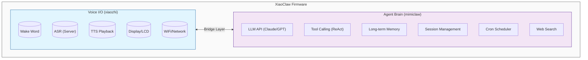

# XiaoClaw: 带本地 Agent 大脑的 AI 语音助手

<p align="center">
  <strong>ESP32-S3 AI 语音助手 — 语音 I/O + 本地 LLM Agent</strong>
</p>

<p align="center">
  <a href="LICENSE"></a>
  <a href="https://github.com/anthropics/claude-code"></a>
</p>

---

## 介绍

**XiaoClaw** 是一个统一的 ESP32-S3 固件，将语音交互与本地 AI Agent 大脑结合在一起。它整合了：

- **xiaozhi-esp32** — 语音 I/O 层：音频录制、播放、唤醒词检测、显示屏、网络通信
- **mimiclaw** — Agent 大脑：LLM 推理、工具调用、记忆管理、自主任务执行

所有功能运行在单个 ESP32-S3 芯片上，配备 32MB Flash 和 8MB PSRAM。



## 功能特性

### 语音 I/O 层 (xiaozhi)

- 离线语音唤醒 ([ESP-SR](https://github.com/espressif/esp-sr))
- 通过服务器连接实现流式 ASR + TTS
- OPUS 音频编解码
- OLED / LCD 显示屏，支持表情显示
- 电池和电源管理
- 多语言支持（中文、英文、日文）
- WebSocket / MQTT 协议支持

### Agent 大脑层 (mimiclaw)

- LLM API 集成 (Anthropic Claude / OpenAI GPT)
- ReAct Agent 循环与工具调用
- 长期记忆 (基于 SPIFFS)
- 会话管理与对话历史
- 定时任务调度器
- 网络搜索能力 (Tavily / Brave)

## 硬件要求

- **ESP32-S3** 开发板
- **32MB Flash**（最低 16MB）
- **8MB PSRAM**（推荐 8线 PSRAM）
- 音频编解码器（带麦克风和扬声器）
- 可选：LCD/OLED 显示屏

### 支持的开发板

XiaoClaw 继承了 xiaozhi-esp32 的开发板支持，包括：

- ESP32-S3-BOX3
- M5Stack CoreS3 / AtomS3R
- 立创实战派 ESP32-S3 开发板
- LILYGO T-Circle-S3
- 以及 70+ 更多开发板...

## 快速开始

### 环境准备

- ESP-IDF v5.5 或更高版本
- Python 3.10+
- CMake 3.16+

### 编译

```bash
# 克隆仓库
git clone https://github.com/your-repo/xiaoclaw.git
cd xiaoclaw

# 设置目标芯片
idf.py set-target esp32s3

# 配置（可选）
idf.py menuconfig

# 编译
idf.py build
```

### 烧录

```bash
# 烧录并监控
idf.py -p PORT flash monitor

# 仅烧录 app 分区（跳过 SPIFFS，保留数据）
esptool.py -p PORT write_flash 0x20000 ./build/xiaozhi.bin
```

### 配置

从示例创建 `main/mimi/mimi_secrets.h`：

```c
#define MIMI_SECRET_WIFI_SSID       "你的WiFi名称"
#define MIMI_SECRET_WIFI_PASS       "你的WiFi密码"
#define MIMI_SECRET_API_KEY         "sk-ant-api03-xxxxx"
#define MIMI_SECRET_MODEL_PROVIDER  "anthropic"  // 或 "openai"
```

## 架构

### Bridge 层

Bridge 层连接语音 I/O 层与 Agent 大脑：


### 内存布局

| 分区   | 大小  | 用途             |
| ------ | ----- | ---------------- |
| ota_0  | 4MB   | 主固件           |
| ota_1  | 4MB   | OTA 备份         |
| spiffs | ~27MB | 记忆、会话、技能 |

### 任务布局

| 任务       | 核心 | 优先级 | 功能        |
| ---------- | ---- | ------ | ----------- |
| audio\_\*  | 0    | 8      | 音频 I/O    |
| main_loop  | 0    | 5      | 应用主循环  |
| bridge     | 0    | 5      | Bridge 通信 |
| agent_loop | 1    | 6      | LLM 处理    |

## 工具

Agent 可以使用多种工具：

| 工具               | 描述                 |
| ------------------ | -------------------- |
| `web_search`       | 搜索网络获取最新信息 |
| `get_current_time` | 获取当前日期/时间    |
| `gpio_write`       | 控制 GPIO 引脚       |
| `gpio_read`        | 读取 GPIO 状态       |
| `cron_add`         | 创建定时任务         |
| `cron_list`        | 列出定时任务         |
| `cron_remove`      | 删除定时任务         |
| `read_file`        | 从 SPIFFS 读取文件   |
| `write_file`       | 写入文件到 SPIFFS    |

**注意：** GPIO 工具遵循 `gpio_policy.h` 中定义的板级策略。

### MCP Client（动态远程工具）

XiaoClaw 支持连接远程 MCP 服务器，动态发现并调用工具。配置在运行时从 skill 文件加载。


**配置文件：** 首次创建 MCP skill 时 AI 会自动生成 `/spiffs/skills/mcp-connection.md`

**Python MCP 服务器示例：** `scripts/mcp_server.py`
```bash
pip install "mcp[cli]"
python scripts/mcp_server.py --port 8000
```

远程工具以 `mcp.` 前缀注册（如 `mcp.get_device_status`），与本地工具区分。

## 记忆系统

XiaoClaw 在 SPIFFS 上以纯文本文件存储数据：

| 路径                | 用途           |
| ------------------- | -------------- |
| `/spiffs/SOUL.md`   | AI 人格定义    |
| `/spiffs/USER.md`   | 用户信息和偏好 |
| `/spiffs/MEMORY.md` | 长期记忆       |
| `/spiffs/HEARTBEAT.md` | 自主任务列表 |
| `/spiffs/cron.json` | 定时任务       |
| `/spiffs/sessions/*.jsonl` | 对话历史 |

## 开发

### 项目结构

```
xiaoclaw/
├── main/
│   ├── mimi/             # Agent 大脑（来自 mimiclaw）
│   │   ├── agent/        # Agent 循环和上下文构建
│   │   ├── bus/          # 消息总线
│   │   ├── channels/     # Telegram、飞书机器人集成
│   │   ├── cli/          # 串口 CLI
│   │   ├── cron/         # Cron 调度器服务
│   │   ├── gateway/      # WebSocket 服务器
│   │   ├── heartbeat/    # 自主任务心跳
│   │   ├── llm/          # LLM 代理
│   │   ├── memory/       # 记忆存储和会话管理
│   │   ├── onboard/      # WiFi 入网配置
│   │   ├── ota/          # OTA 更新
│   │   ├── proxy/        # HTTP 代理
│   │   ├── skills/       # 技能加载器
│   │   ├── tools/        # 工具注册表
│   │   └── wifi/         # WiFi 管理器
│   ├── audio/            # 语音 I/O（来自 xiaozhi）
│   ├── bridge/           # Bridge 层
│   ├── display/
│   ├── protocols/
│   ├── boards/
│   ├── assets.cc/h       # 资源管理
│   ├── application.cc/h  # 主应用
│   ├── device_state.h   # 设备状态
│   ├── device_state_machine.cc/h # 状态机
│   ├── idf_component.yml # 组件清单
│   ├── main.cc           # 入口点
│   ├── mcp_server.cc/h   # MCP 服务器
│   ├── ota.cc/h          # OTA 更新
│   ├── settings.cc/h     # 设置管理
│   └── system_info.cc/h  # 系统信息
├── spiffs_data/          # SPIFFS 内容
├── CMakeLists.txt
└── sdkconfig.defaults.esp32s3
```

### 调试

使用串口 CLI 命令（通过 UART 端口）：

```
mimi> heap_info          # 内存状态
mimi> memory_read        # 查看长期记忆
mimi> session_list       # 列出对话
mimi> config_show        # 显示配置
```

## 相关项目

XiaoClaw 基于以下优秀项目构建：

- [xiaozhi-esp32](https://github.com/78/xiaozhi-esp32) — 语音交互框架
- [mimiclaw](https://github.com/memovai/mimiclaw) — ESP32 AI Agent

## 许可证

MIT License

## 致谢

- xiaozhi-esp32 团队的语音交互框架
- mimiclaw 团队的嵌入式 AI Agent 架构
- 乐鑫的 ESP-IDF 和 ESP-SR
