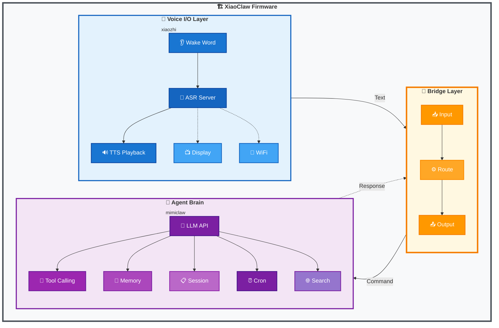
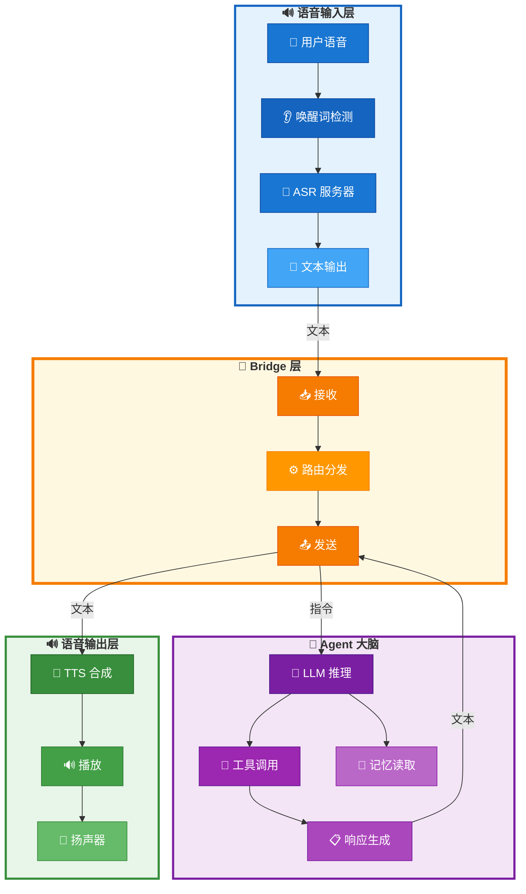

# XiaoClaw: 带本地 Agent 大脑的 AI 语音助手

<p align="center">
  <strong>ESP32-S3 AI 语音助手 — 语音 I/O + 本地 LLM Agent</strong>
</p>

<p align="center">
  🌐 <a href="https://beancookie.github.io/xiaoclaw/"><strong>官方网站</strong></a>
</p>

<p align="center">
  <a href="LICENSE"></a>
  <a href="https://github.com/anthropics/claude-code"></a>
  <a href="https://beancookie.github.io/xiaoclaw/"></a>
</p>

---

## 介绍

**XiaoClaw** 是一个统一的 ESP32-S3 固件，将语音交互与本地 AI Agent 大脑结合在一起。它整合了：

- **xiaozhi-esp32** — 语音 I/O 层：音频录制、播放、唤醒词检测、显示屏、网络通信
- **mimiclaw** — Agent 大脑：LLM 推理、工具调用、记忆管理、自主任务执行

所有功能运行在单个 ESP32-S3 芯片上，配备 32MB Flash 和 8MB PSRAM。



## 功能特性

### 语音 I/O 层 (xiaozhi)

- 离线语音唤醒 ([ESP-SR](https://github.com/espressif/esp-sr))
- 通过服务器连接实现流式 ASR + TTS
- OPUS 音频编解码
- OLED / LCD 显示屏，支持表情显示
- 电池和电源管理
- 多语言支持（中文、英文、日文）
- WebSocket / MQTT 协议支持

### Agent 大脑层 (mimiclaw)

- LLM API 集成 (Anthropic Claude / OpenAI GPT)
- 模块化 ReAct Agent 循环，`AgentRunner` 执行引擎
- Hook 系统支持迭代/工具回调 (`before_iteration`, `after_iteration`, `on_tool_result`, `before_tool_execute`)
- Checkpoint 系统用于崩溃恢复
- Context Builder 模块化系统 prompt 构建
- Session 合并压缩，自动历史整理
- 长期记忆 (基于 SPIFFS)
- 基于游标的会话历史追踪
- 定时任务调度器
- 网络搜索能力 (Tavily / Brave)

## 硬件要求

- **ESP32-S3** 开发板
- **32MB Flash**（最低 16MB）
- **8MB PSRAM**（推荐 8线 PSRAM）
- 音频编解码器（带麦克风和扬声器）
- 可选：LCD/OLED 显示屏

### 支持的开发板

XiaoClaw 继承了 xiaozhi-esp32 的开发板支持，包括：

- ESP32-S3-BOX3
- M5Stack CoreS3 / AtomS3R
- 立创实战派 ESP32-S3 开发板
- LILYGO T-Circle-S3
- 以及 70+ 更多开发板...

## 快速开始

### 环境准备

- ESP-IDF v5.5 或更高版本
- Python 3.10+
- CMake 3.16+

### 编译

```bash
# 克隆仓库
git clone https://github.com/your-repo/xiaoclaw.git
cd xiaoclaw

# 设置目标芯片
idf.py set-target esp32s3

# 配置（可选）
idf.py menuconfig

# 编译
idf.py build
```

### 烧录

```bash
# 烧录并监控
idf.py -p PORT flash monitor

# 仅烧录 app 分区（跳过 SPIFFS，保留数据）
esptool.py -p PORT write_flash 0x20000 ./build/xiaozhi.bin
```

### 配置

从示例创建 `main/mimi/mimi_secrets.h`：

```c
#define MIMI_SECRET_WIFI_SSID       "你的WiFi名称"
#define MIMI_SECRET_WIFI_PASS       "你的WiFi密码"
#define MIMI_SECRET_API_KEY         "sk-ant-api03-xxxxx"
#define MIMI_SECRET_MODEL_PROVIDER  "anthropic"  // 或 "openai"
```

## 架构

### Bridge 层

Bridge 层连接语音 I/O 层与 Agent 大脑：



### 内存布局

| 分区     | 大小  | 用途                 |
| -------- | ----- | -------------------- |
| nvs      | 32KB  | 非易失性存储         |
| otadata  | 8KB   | OTA 数据             |
| phy_init | 4KB   | 物理初始化数据       |
| ota_0    | 5MB   | 主固件               |
| ota_1    | 5MB   | OTA 备份             |
| assets   | 7MB   | 模型资源（唤醒词等） |
| model    | 1MB   | AI 模型存储          |
| spiffs   | ~14MB | 记忆、会话、技能     |

### 任务布局

| 任务       | 核心 | 优先级 | 功能        |
| ---------- | ---- | ------ | ----------- |
| audio\_\*  | 0    | 8      | 音频 I/O    |
| main_loop  | 0    | 5      | 应用主循环  |
| bridge     | 0    | 5      | Bridge 通信 |
| agent_loop | 1    | 6      | LLM 处理    |

## 工具

Agent 可以使用多种工具：

| 工具               | 描述                    |
| ------------------ | ----------------------- |
| `web_search`       | 搜索网络获取最新信息    |
| `get_current_time` | 获取当前日期/时间       |
| `gpio_write`       | 控制 GPIO 引脚          |
| `gpio_read`        | 读取 GPIO 状态          |
| `gpio_read_all`    | 读取所有允许的 GPIO     |
| `lua_eval`         | 直接执行 Lua 代码       |
| `lua_run`          | 从 SPIFFS 执行 Lua 脚本 |
| `mcp_connect`      | 连接 MCP 服务器         |
| `mcp_disconnect`   | 断开 MCP 服务器连接     |
| `cron_add`         | 创建定时任务            |
| `cron_list`        | 列出定时任务            |
| `cron_remove`      | 删除定时任务            |
| `read_file`        | 从 SPIFFS 读取文件      |
| `write_file`       | 写入文件到 SPIFFS       |
| `edit_file`        | 编辑文件（查找替换）    |
| `list_dir`         | 列出目录中的文件        |

**注意：** GPIO 工具遵循 `gpio_policy.h` 中定义的板级策略。

### MCP Client（动态远程工具）

XiaoClaw 支持连接远程 MCP 服务器，动态发现并调用工具。服务器配置存储在 `mcp-servers.md` skill 文件中。

**配置文件：** `/spiffs/skills/mcp-servers.md`

```markdown
# MCP Servers

## my_server

- host: 192.168.1.100
- port: 8000
- endpoint: mcp
```

**可用工具：**
| 工具 | 描述 |
|------|------|
| `mcp_connect` | 按名称连接 MCP 服务器 |
| `mcp_disconnect` | 断开当前服务器连接 |

**Python MCP 服务器示例：** `scripts/mcp_server.py`

```bash
pip install "mcp[cli]"
python scripts/mcp_server.py --port 8000
```

远程工具以 `{server_name}.` 前缀注册（如 `my_server.get_device_status`），与本地工具区分。

### Lua 脚本

XiaoClaw 支持 Lua 脚本，可用于自定义逻辑和 HTTP 请求。脚本存储在 `/spiffs/lua/` 目录。

**内置函数：**
| 函数 | 描述 |
|------|------|
| `print(...)` | 打印输出到日志 |
| `http_get(url)` | HTTP GET 请求，返回 `response, status` |
| `http_post(url, body, content_type)` | HTTP POST 请求 |
| `http_put(url, body, content_type)` | HTTP PUT 请求 |
| `http_delete(url)` | HTTP DELETE 请求 |

**示例脚本：** `/spiffs/lua/hello.lua`

```lua
local greeting = "Hello from Lua!"
local timestamp = os.time()
return string.format("%s (timestamp: %d)", greeting, timestamp)
```

**HTTP 示例：** `/spiffs/lua/http_example.lua`

```lua
local response, status = http_get("https://example.com")
print("Status:", status)
print("Response:", response)
```

脚本可以返回值，会被序列化为 JSON 返回给 Agent。

## 记忆系统

XiaoClaw 在 SPIFFS 上以纯文本文件存储数据，支持会话合并压缩：

| 路径                           | 用途                         |
| ------------------------------ | ---------------------------- |
| `/spiffs/config/SOUL.md`       | AI 人格定义                  |
| `/spiffs/config/USER.md`       | 用户信息和偏好               |
| `/spiffs/memory/MEMORY.md`     | 长期记忆                     |
| `/spiffs/HEARTBEAT.md`         | 自主任务列表（运行时）       |
| `/spiffs/cron.json`            | 定时任务（运行时）           |
| `/spiffs/sessions/tg_*.jsonl`  | 对话历史 (JSONL 格式)        |
| `/spiffs/sessions/tg_*.meta`   | 会话元数据（游标、已合并数） |
| `/spiffs/archive/tg_*.archive` | 归档的旧消息                 |

### 会话管理

- **游标追踪**: 每个会话通过游标跟踪已读取位置，高效遍历历史
- **合并压缩**: 当会话超过 `max_history`（默认 50）条消息时，最旧 `consolidate_batch`（默认 20）条消息归档到 `/spiffs/archive/`
- **LRU 缓存**: 活跃会话缓存在内存中（最多 8 个会话）快速访问
- **检查点恢复**: Agent 崩溃后可从上一个检查点恢复

### Skills 系统

Skills 从 `/spiffs/skills/` 目录加载，每个技能是一个目录，包含 `SKILL.md` 文件：

```
/spiffs/skills/
├── weather/
│   └── SKILL.md
├── get-time/
│   └── SKILL.md
└── lua-scripts/
    └── SKILL.md
```

**Frontmatter 格式：**

```yaml
---
name: weather
description: 获取天气信息和预报
always: false
---
# Weather Skill
...
```

- **`name`**: 技能标识符
- **`description`**: 简短描述
- **`always: true`**: 技能内容始终注入 system prompt
- **`requires.bins`**: 技能所需的 CLI 工具（可选）
- **`requires.env`**: 所需的环境变量（可选）

**技能文件格式：**

- `SKILL.md` - 包含技能描述、使用说明和示例
- 工具定义格式：`Tool: tool_name\nInput: {json}`

## 开发

### 项目结构

```
xiaoclaw/
├── main/
│   ├── mimi/             # Agent 大脑（来自 mimiclaw）
│   │   ├── agent/        # Agent 循环、runner、hooks、checkpoint
│   │   │   ├── agent_loop.c   # Agent 主任务循环
│   │   │   ├── runner.c       # ReAct 执行引擎
│   │   │   ├── context_builder.c # 系统 prompt 构建
│   │   │   ├── hook.c         # Agent hooks 实现
│   │   │   └── checkpoint.c   # 崩溃恢复检查点
│   │   ├── bus/          # 消息总线
│   │   ├── channels/     # Telegram、飞书机器人集成
│   │   ├── cron/         # Cron 调度器服务
│   │   ├── gateway/      # WebSocket 服务器
│   │   ├── heartbeat/    # 自主任务心跳
│   │   ├── llm/          # LLM 代理
│   │   ├── memory/       # 记忆存储、会话管理器、合并器
│   │   │   ├── memory_store.c    # 长期记忆
│   │   │   ├── session_manager.c # 带游标/合并的会话
│   │   │   └── consolidator.c     # 自动历史压缩
│   │   ├── ota/          # OTA 更新
│   │   ├── proxy/        # HTTP 代理
│   │   ├── skills/       # 支持 frontmatter 的技能加载器
│   │   ├── tools/        # 支持并发的工具注册表
│   ├── audio/            # 语音 I/O（来自 xiaozhi）
│   ├── bridge/           # Bridge 层
│   ├── display/
│   ├── protocols/
│   ├── boards/
│   ├── led/              # LED 控制
│   ├── lua/              # Lua 脚本支持
│   ├── memory/           # 内存管理
│   ├── skills/           # 技能系统
│   ├── assets.cc/h       # 资源管理
│   ├── application.cc/h  # 主应用
│   ├── device_state.h   # 设备状态
│   ├── device_state_machine.cc/h # 状态机
│   ├── idf_component.yml # 组件清单
│   ├── main.cc           # 入口点
│   ├── mcp_server.cc/h   # MCP 服务器
│   ├── ota.cc/h          # OTA 更新
│   ├── settings.cc/h     # 设置管理
│   └── system_info.cc/h  # 系统信息
├── spiffs_data/          # SPIFFS 内容（烧录到 /spiffs 分区）
│   ├── config/           # SOUL.md, USER.md
│   ├── lua/              # Lua 脚本（hello.lua, http_example.lua）
│   ├── memory/            # MEMORY.md
│   └── skills/            # get-time/, lua-scripts/, mcp-servers/, skill-creator/, weather/
├── CMakeLists.txt
└── sdkconfig.defaults.esp32s3
```

## 相关项目

XiaoClaw 基于以下优秀项目构建：

- [xiaozhi-esp32](https://github.com/78/xiaozhi-esp32) — 语音交互框架
- [mimiclaw](https://github.com/memovai/mimiclaw) — ESP32 AI Agent

## 许可证

MIT License

## 致谢

- xiaozhi-esp32 团队的语音交互框架
- mimiclaw 团队的嵌入式 AI Agent 架构
- 乐鑫的 ESP-IDF 和 ESP-SR
