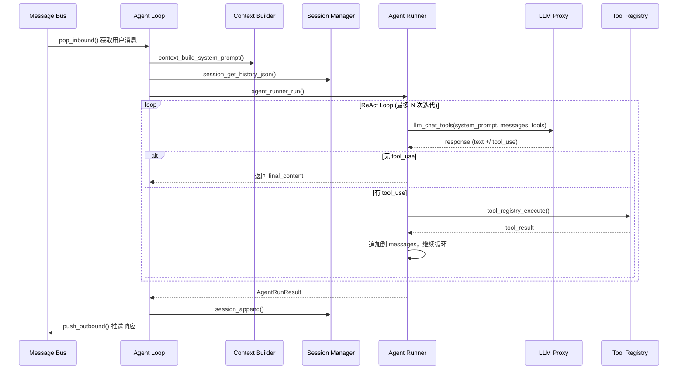
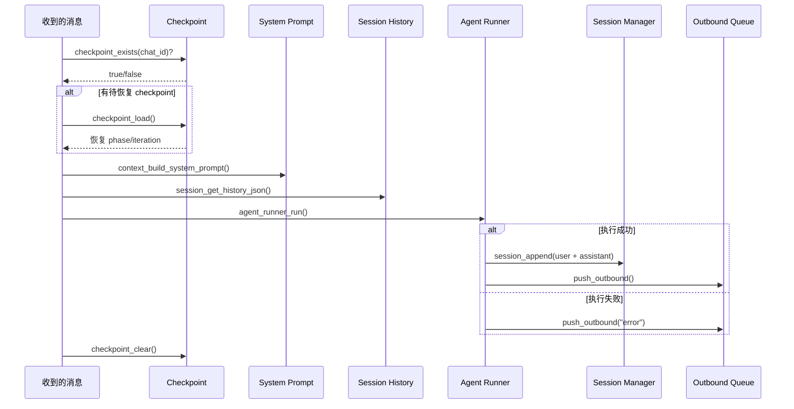
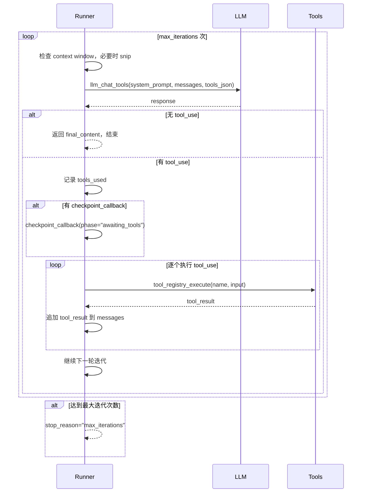
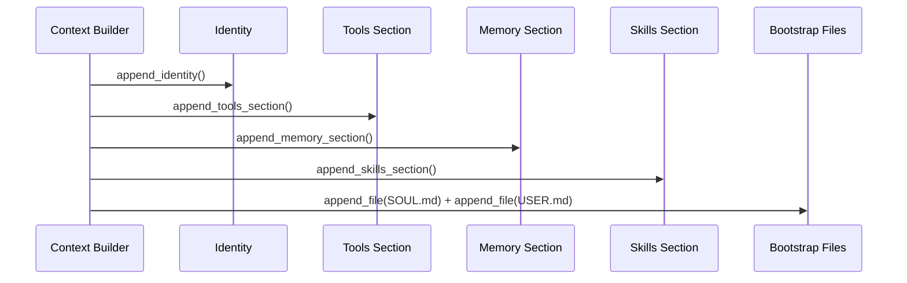
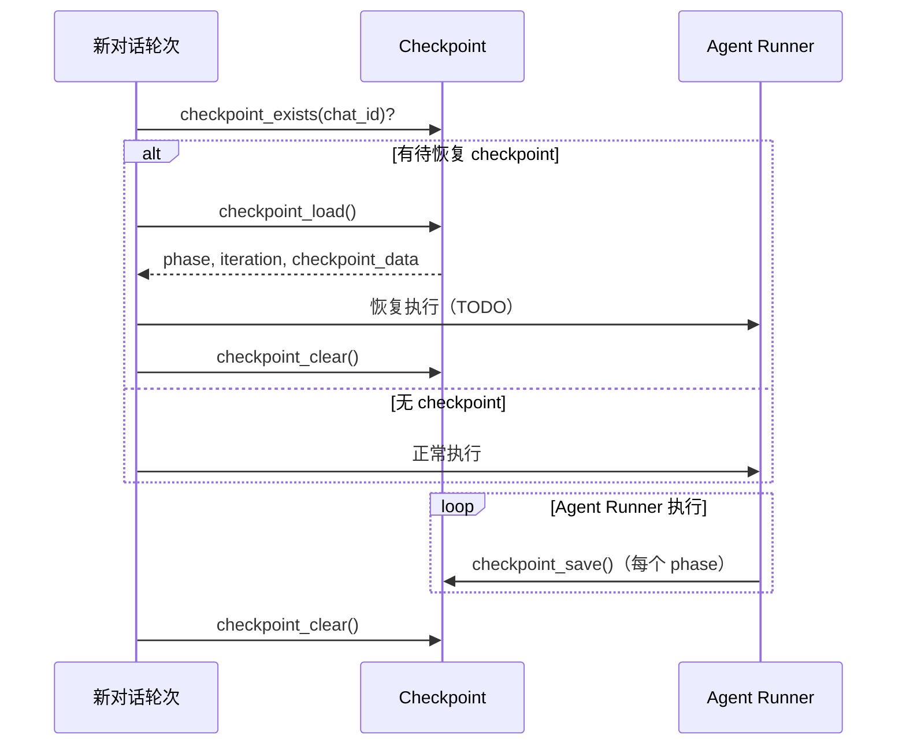

# Agent 系统架构

NOTICE: AI 辅助生成, 在实现后台服务时, 请参照代码确认细节!!

本文档介绍 XiaoClaw 的 Agent 系统架构，包括 ReAct Loop 执行器、Context 构建器、Checkpoint 恢复机制及 Hook 回调接口。

## 系统概述

Agent 系统是 XiaoClaw 的推理引擎，基于 ReAct（Reasoning + Acting）模式实现工具调用能力。



---

## 1. Agent Loop

`agent_loop.c` 是主循环任务，运行在专用 Core（Core 1）上。

### 初始化

```c
esp_err_t agent_loop_init(void);
esp_err_t agent_loop_start(void);
```

### 消息处理流程



### 内存布局

| 缓冲区 | 大小 | 位置 | 用途 |
|--------|------|------|------|
| `system_prompt` | `MIMI_CONTEXT_BUF_SIZE` | PSRAM | System prompt 缓存 |
| `history_json` | `MIMI_LLM_STREAM_BUF_SIZE` | PSRAM | 会话历史 JSON |

---

## 2. Agent Runner

`runner.c` 实现 ReAct Loop 执行器。

### AgentRunSpec

```c
typedef struct {
    const char *system_prompt;        // System prompt 字符串
    cJSON *initial_messages;          // 初始消息数组
    const char *tools_json;            // 预构建的 tools JSON
    int max_iterations;               // 最大工具调用迭代次数
    int max_tool_result_chars;        // 单个工具结果最大字符数
    const char *error_message;        // LLM 失败时的错误消息
    bool concurrent_tools;            // 是否启用并发工具执行
    void (*checkpoint_callback)(...); // Checkpoint 回调
    void *checkpoint_session_key;     // Checkpoint 会话键
    const mimi_msg_t *current_msg;    // 当前消息上下文
} AgentRunSpec;
```

### AgentRunResult

```c
typedef struct {
    char *final_content;              // 最终响应（需 caller free）
    cJSON *messages;                  // 完整消息历史（需 caller cJSON_Delete）
    int tools_used_count;             // 工具调用次数
    char tools_used[32][32];          // 使用的工具名称
    int usage_prompt_tokens;          // 估算的 prompt tokens
    int usage_completion_tokens;      // 估算的 completion tokens
    const char *stop_reason;          // "completed" | "max_iterations" | "error" | "tool_error"
    char *error;                      // 错误消息（如有）
} AgentRunResult;
```

### ReAct Loop 执行流程



### Context Snipping

当消息历史接近 context window 限制时，自动裁剪最旧的消息：

```c
// 保留策略：至少保留 2 条消息
// 裁剪单位：从最旧的消息开始裁剪，直到 token 数 < target
static void snip_history(cJSON *messages, int max_context_tokens);
```

---

## 3. Context Builder

`context_builder.c` 负责构建 System Prompt 和 Runtime Context。

### System Prompt 构建顺序



### System Prompt 内容结构

```
# XiaoClaw: AI Voice Assistant with Local Agent Brain

[Identity section]

## Available Tools

- /spiffs/skills/lua-scripts/SKILL.md: Execute Lua scripts...
- /spiffs/skills/mcp-servers/SKILL.md: Connect to MCP servers...
[... more skills]

Other tools:
- read_file: Read a file from SPIFFS.
- write_file: Write/overwrite a file.
- edit_file: Find-and-replace edit.
- list_dir: List files in a directory.

## Memory

[Memory instructions + Long-term Memory + Recent Notes]

## Skills

## Active Skills

[mcp-servers 完整内容（always=true）]

## Available Skills (read full instructions with read_file when needed)

<skills>
  <skill available="true">...</skill>
</skills>

## Personality

[SOUL.md 内容]

## User Info

[USER.md 内容]
```

### Runtime Context

运行时上下文注入在用户消息之前：

```
[Runtime Context — metadata only, not instructions]
Current Time: 2026-04-18 10:30:00 CST
Channel: xiaozhi
Chat ID: 12345
```

### API

| 函数 | 说明 |
|------|------|
| `context_build_system_prompt(buf, size)` | 构建完整 System Prompt |
| `context_build_runtime_context(buf, size, channel, chat_id)` | 构建运行时上下文 |
| `context_build_messages(history, current_message, channel, chat_id, output_buf, output_size)` | 构建完整消息列表 |

---

## 4. Checkpoint 恢复机制

`checkpoint.c` 实现对话轮次中断恢复。

### Checkpoint Phases

```c
typedef enum {
    CHECKPOINT_PHASE_STARTED,        // 轮次开始
    CHECKPOINT_PHASE_AWAITING_TOOLS, // 等待工具执行
    CHECKPOINT_PHASE_TOOLS_DONE,     // 工具执行完成
    CHECKPOINT_PHASE_FINAL_RESPONSE  // 最终响应生成
} checkpoint_phase_t;
```

### Checkpoint 流程



### API

| 函数 | 说明 |
|------|------|
| `checkpoint_save(chat_id, phase, iteration, checkpoint)` | 保存 checkpoint |
| `checkpoint_load(chat_id, phase, iteration, checkpoint)` | 加载 checkpoint |
| `checkpoint_clear(chat_id)` | 清除 checkpoint |
| `checkpoint_exists(chat_id)` | 检查是否存在 checkpoint |

---

## 5. Hook 回调接口

`hook.c` 提供 Agent 执行过程的回调钩子。

### AgentHooks

```c
typedef struct {
    void (*before_iteration)(int iteration);              // 每次 LLM 迭代前
    void (*after_iteration)(int iteration, const char *final_content);  // 每次 LLM 迭代后
    void (*before_tool_execute)(const char *tool_name);   // 每个工具执行前
    void (*after_tool_execute)(const char *tool_name, const char *result, bool success);  // 每个工具执行后
} AgentHooks;
```

### 使用示例

```c
AgentHooks hooks = {
    .before_iteration = my_before_iter,
    .after_tool_execute = my_after_tool,
};

#define HOOK_BEFORE_ITERATION(hooks, iter) \
    do { if ((hooks) && (hooks)->before_iteration) (hooks)->before_iteration(iter); } while(0)
```

---

## 6. 相关文件

| 文件 | 说明 |
|------|------|
| `main/mimi/agent/agent_loop.h` | Agent Loop 公共 API |
| `main/mimi/agent/agent_loop.c` | Agent Loop 主任务实现 |
| `main/mimi/agent/runner.h` | Agent Runner 公共 API |
| `main/mimi/agent/runner.c` | ReAct Loop 执行器实现 |
| `main/mimi/agent/context_builder.h` | Context Builder 公共 API |
| `main/mimi/agent/context_builder.c` | System Prompt 构建器实现 |
| `main/mimi/agent/checkpoint.h` | Checkpoint 公共 API |
| `main/mimi/agent/checkpoint.c` | Checkpoint 恢复机制实现 |
| `main/mimi/agent/hook.h` | Hook 回调接口定义 |
| `main/mimi/agent/hook.c` | Hook 回调实现 |

---

## 7. 配置参数

| 参数 | 默认值 | 说明 |
|------|--------|------|
| `MIMI_CONTEXT_BUF_SIZE` | 32KB | Context buffer 大小 |
| `MIMI_AGENT_MAX_TOOL_ITER` | 10 | 最大工具调用迭代次数 |
| `MIMI_AGENT_MAX_HISTORY` | 50 | 会话历史最大消息数 |
| `MIMI_AGENT_STACK` | TBD | Agent Loop 栈大小 |
| `MIMI_AGENT_PRIO` | TBD | Agent Loop 优先级 |
| `MIMI_AGENT_CORE` | TBD | Agent Loop 绑定的 CPU Core |
