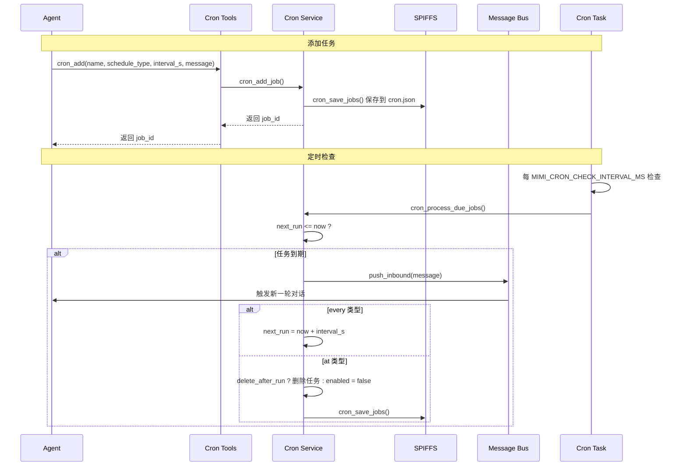

# Cron 定时任务服务

NOTICE: AI 辅助生成, 在实现后台服务时, 请参照代码确认细节!!

本文档介绍 XiaoClaw 的 Cron 定时任务服务架构，包括任务类型、持久化机制及 API 参考。

## 系统概述

Cron 是基于 FreeRTOS Task 的定时任务服务，支持周期性任务（every）和一次性任务（at）两种类型。



---

## 1. 任务类型

### CRON_KIND_EVERY（周期性任务）

按固定间隔重复执行的任务。

```c
typedef struct {
    char name[32];           // 任务名称
    cron_kind_t kind;        // = CRON_KIND_EVERY
    uint32_t interval_s;     // 间隔秒数
    char message[256];       // 触发时发送的消息
} cron_job_t;
```

### CRON_KIND_AT（一次性任务）

在指定 Unix 时间戳触发一次。

```c
typedef struct {
    char name[32];           // 任务名称
    cron_kind_t kind;        // = CRON_KIND_AT
    int64_t at_epoch;        // 目标 Unix 时间戳
    char message[256];       // 触发时发送的消息
    bool delete_after_run;   // 执行后是否删除
} cron_job_t;
```

---

## 2. cron_job_t 结构

```c
typedef struct {
    char id[9];              // 8 位十六进制 ID
    char name[32];           // 任务名称
    bool enabled;            // 是否启用
    cron_kind_t kind;        // CRON_KIND_EVERY 或 CRON_KIND_AT
    uint32_t interval_s;     // 间隔秒数（every 类型）
    int64_t at_epoch;        // 目标时间戳（at 类型）
    char message[256];       // 触发消息
    char channel[16];        // 回复渠道
    char chat_id[96];        // 聊天 ID
    int64_t last_run;        // 上次执行时间
    int64_t next_run;        // 下次执行时间
    bool delete_after_run;   // 执行后删除（at 类型）
} cron_job_t;
```

---

## 3. 持久化机制

### 存储位置

```
/spiffs/cron.json
```

### JSON 格式

```json
{
  "jobs": [
    {
      "id": "a1b2c3d4",
      "name": "hourly_reminder",
      "enabled": true,
      "kind": "every",
      "interval_s": 3600,
      "message": "喝水时间到！",
      "channel": "xiaozhi",
      "chat_id": "cron",
      "last_run": 1744982400,
      "next_run": 1744986000,
      "delete_after_run": false
    },
    {
      "id": "e5f6g7h8",
      "name": "meeting_reminder",
      "enabled": true,
      "kind": "at",
      "at_epoch": 1745691400,
      "message": "会议将在 1 小时后开始",
      "channel": "xiaozhi",
      "chat_id": "cron",
      "last_run": 0,
      "next_run": 1745691400,
      "delete_after_run": true
    }
  ]
}
```

### 持久化策略

| 操作 | 是否保存到 SPIFFS |
|------|------------------|
| 添加任务 (`cron_add_job`) | 是 |
| 删除任务 (`cron_remove_job`) | 是 |
| `every` 类型触发 | 否（仅更新内存） |
| `at` 类型触发（删除） | 是 |

NOTICE: `every` 类型任务触发时只更新内存中的 `next_run`，避免频繁写入 SPIFFS。只有 `at` 类型删除时才写入。

---

## 4. API 参考

### cron_service_init

```c
esp_err_t cron_service_init(void);
```

初始化 Cron 服务，从 SPIFFS 加载任务。

**返回值**: `ESP_OK` on success

---

### cron_service_start

```c
esp_err_t cron_service_start(void);
```

启动 Cron 任务，进入定时检查循环。

---

### cron_add_job

```c
esp_err_t cron_add_job(cron_job_t *job);
```

添加新任务。

| 参数 | 类型 | 说明 |
|------|------|------|
| `job` | `cron_job_t*` | 任务结构（id 由函数生成） |

**返回值**: `ESP_OK` on success, `ESP_ERR_NO_MEM` if max jobs reached

---

### cron_remove_job

```c
esp_err_t cron_remove_job(const char *job_id);
```

按 ID 删除任务。

| 参数 | 类型 | 说明 |
|------|------|------|
| `job_id` | `const char*` | 8 位十六进制任务 ID |

**返回值**: `ESP_OK` on success, `ESP_ERR_NOT_FOUND` if not found

---

### cron_list_jobs

```c
void cron_list_jobs(const cron_job_t **jobs, int *count);
```

列出所有任务。

| 参数 | 类型 | 说明 |
|------|------|------|
| `jobs` | `cron_job_t**` | 输出：任务数组指针 |
| `count` | `int*` | 输出：任务数量 |

---

## 5. 配置参数

| 参数 | 默认值 | 说明 |
|------|--------|------|
| `MIMI_CRON_FILE` | `/spiffs/cron.json` | 任务存储文件 |
| `MIMI_CRON_MAX_JOBS` | 16 | 最大任务数 |
| `MIMI_CRON_CHECK_INTERVAL_MS` | 60000 (1 分钟) | 检查间隔 |

---

## 6. 相关文件

| 文件 | 说明 |
|------|------|
| `main/mimi/cron/cron_service.h` | Cron Service 公共 API |
| `main/mimi/cron/cron_service.c` | Cron Service 实现 |
| `main/mimi/tools/tool_cron.h` | Cron Tools 头文件 |
| `main/mimi/tools/tool_cron.c` | cron_add/cron_list/cron_remove 工具实现 |
| `spiffs_data/cron.json` | 任务持久化文件 |

---

## 7. 与 Heartbeat 的区别

| 特性 | Cron | Heartbeat |
|------|------|-----------|
| **任务定义** | Agent 通过 cron_add 动态创建 | 用户手动编辑 HEARTBEAT.md |
| **触发方式** | 定时检查，到期自动触发 | Agent 主动读取并判断 |
| **任务存储** | SPIFFS JSON 文件 | 文件系统 Markdown |
| **适用场景** | 明确时间的提醒 | 开放式待办事项 |
| **最大数量** | 16 个 | 无限制 |
