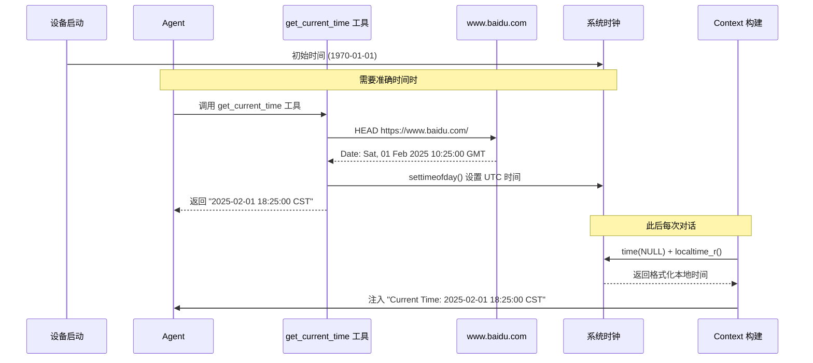
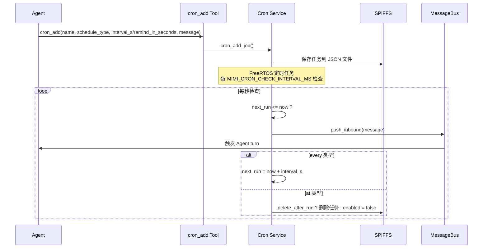

# 定时任务与时间工具

NOTICE: AI 辅助生成, 在实现后台服务时, 请参照代码确认细节!!

本文档介绍 xiaozhi 设备的时间相关功能，包括时间获取机制、定时任务和一次性提醒。

## 时区配置

设备使用 Asia/Shanghai 时区（UTC+8），在配置中表示为：
```c
#define MIMI_TIMEZONE "Asia/Shanghai"
```

时区在系统初始化时 (`memory_store_init()`) 一次性设置，后续调用 `localtime_r()` 无需重复设置。

显示时固定使用 `CST`（China Standard Time）标识，如 `2025-02-01 18:25:00 CST`。

---

## 1. xiaozhi 内部时间获取机制

### 系统时钟初始化

ESP32-S3 设备上电后，系统时钟默认从 1970-01-01 开始计时。xiaozhi 通过以下方式同步准确时间：

### 时间同步流程



### 运行时时间注入 (context_builder)

在每次 Agent 对话轮次（turn）开始前，系统会自动注入当前时间到上下文中：

```c
// main/mimi/agent/context_builder.c

static void get_current_time_str(char *buf, size_t size)
{
    tzset();  // 确保时区已设置（防御性调用）
    time_t now = time(NULL);
    struct tm timeinfo;
    localtime_r(&now, &timeinfo);
    strftime(buf, size, "%Y-%m-%d %H:%M:%S CST", &timeinfo);
}
```

时区在系统启动时通过 `memory_store_init()` 一次性设置（`setenv("TZ", "Asia/Shanghai", 1)` + `tzset()`）。

### Agent 上下文中的时间

每次用户消息到达时，Agent 会收到类似以下的上下文信息：

```
[Runtime Context — metadata only, not instructions]
Current Time: 2025-02-01 18:25:00 CST
Channel: telegram
Chat ID: 123456789
```

这样 Agent 就知道当前时间，可以：
- 判断是否该提醒用户做某事
- 在 cron 任务触发时知道具体时间
- 根据时间调整回复内容

---

## 2. 获取当前时间 (get_current_time)

### 功能说明

联网获取当前日期和时间，自动设置系统时钟。Agent 调用此工具可以获取准确的本地时间。

### 实现原理

xiaozhi 通过 HTTP HEAD 请求从网络获取时间：

1. **请求目标**：如果启用了 HTTP 代理，通过代理发送 HEAD 请求到 `www.baidu.com`；否则直接通过 HTTPS 发送请求
2. **时间来源**：解析 HTTP 响应头中的 `Date` 字段（RFC 7231 格式，如 `Sat, 01 Feb 2025 10:25:00 GMT`）
3. **时钟设置**：使用 `settimeofday()` 设置系统时钟（UTC 时间）
4. **格式化输出**：转换为本地时区（Asia/Shanghai）后输出

```cpp
// 代码实现：main/mimi/tools/tool_get_time.c

static esp_err_t fetch_time_via_proxy(char *out, size_t out_size) {
    proxy_conn_t *conn = proxy_conn_open("www.baidu.com", 443, 10000);
    // ... 通过代理发送 HEAD 请求
}

static esp_err_t fetch_time_direct(char *out, size_t out_size) {
    esp_http_client_config_t config = {
        .url = "https://www.baidu.com/",
        .method = HTTP_METHOD_HEAD,
        // ... 直接 HTTPS 请求
    };
}
```

### 输入输出

**输入参数**：
```json
{}
```
无参数要求。

**输出示例**：
```
2025-02-01 18:25:00 CST
```

---

## 3. 获取 Unix 时间戳 (unix_now)

### 功能说明

返回当前 Unix 时间戳（自 1970-01-01 00:00:00 UTC以来的秒数）。主要用于计算 `cron_add` 工具的 `at_epoch` 参数。

### 使用场景

当需要设置一个绝对时间的定时任务时，先调用此工具获取当前时间戳，然后加上偏移量得到目标时间：

```json
// 获取当前时间戳
{"tool": "unix_now", ...}
// 返回: "1735689600"

// 计算 30 分钟后的时间戳用于 cron_add
// 目标时间 = 1735689600 + 30*60 = 1735691400
```

### 输入输出

**输入参数**：
```json
{}
```
无参数要求。

**输出示例**：
```
1735689600
```

---

## 4. 定时任务 (cron_add - every)

### 功能说明

创建周期性执行的定时任务。任务会按指定间隔重复执行，适用于定期提醒、数据采集等场景。

### 输入参数

| 字段 | 类型 | 必填 | 说明 |
|------|------|------|------|
| `name` | string | 是 | 任务名称，用于标识 |
| `schedule_type` | string | 是 | 固定为 `"every"` |
| `interval_s` | integer | 是 | 间隔秒数（如 `3600` 表示每小时） |
| `message` | string | 是 | 触发时发送给 Agent 的消息内容 |
| `channel` | string | 否 | 回复渠道，如 `"telegram"`，默认使用当前渠道 |
| `chat_id` | string | 否 | Telegram 聊天 ID，必填当 `channel="telegram"` 时 |
| `delete_after_run` | boolean | 否 | 仅适用 `at` 类型，一次性任务执行后是否删除 |

### 调用示例

**每小时提醒**：
```json
{
  "name": "hourly_reminder",
  "schedule_type": "every",
  "interval_s": 3600,
  "message": "喝水时间到！"
}
```

**每天早上 9 点提醒**：
```json
{
  "name": "morning_alarm",
  "schedule_type": "every",
  "interval_s": 86400,
  "message": "早上好，该起床了！"
}
```

**输出示例**：
```
Job added: id=a1b2c3d4, next_run=2025-02-01 09:00:00 CST, interval=86400s
```

---

## 5. 一次性提醒 (cron_add - at)

### 功能说明

创建单次执行的定时任务。任务在指定时间触发一次后自动删除（或禁用）。

### 输入参数

| 字段 | 类型 | 必填 | 说明 |
|------|------|------|------|
| `name` | string | 是 | 任务名称 |
| `schedule_type` | string | 是 | 固定为 `"at"` |
| `remind_in_seconds` | integer | 条件必填 | 多少秒后触发（如 `180` 表示 3 分钟后） |
| `at_epoch` | integer | 条件必填 | 目标 Unix 时间戳（二选一，推荐使用 `remind_in_seconds`） |
| `message` | string | 是 | 触发时发送给 Agent 的消息内容 |
| `channel` | string | 否 | 回复渠道 |
| `chat_id` | string | 否 | Telegram 聊天 ID |
| `delete_after_run` | boolean | 否 | 执行后是否删除，默认 `true` |

### 调用示例

**3 分钟后提醒**：
```json
{
  "name": "meeting_reminder",
  "schedule_type": "at",
  "remind_in_seconds": 180,
  "message": "会议将在 1 小时后开始"
}
```

**指定时间提醒**：
```json
{
  "name": "alarm",
  "schedule_type": "at",
  "at_epoch": 1735691400,
  "message": "闹钟响了！"
}
```

### 错误处理

- `at_epoch` 已过：返回错误 "at_epoch is in the past"
- `at_epoch` 和 `remind_in_seconds` 都未提供：返回错误 "at requires remind_in_seconds or at_epoch"

---

## 6. 列出和删除任务

### cron_list - 列出所有任务

查看当前所有定时任务的状态和下次执行时间。

**输入参数**：无

**输出示例**：
```
ID         Name              Type    Interval/At    Next Run              Enabled
a1b2c3d4   hourly_reminder   every   3600s          2025-02-01 19:00:00 CST  yes
e5f6g7h8   meeting_reminder  at      1735691400     2025-02-01 18:30:00 CST  yes
```

### cron_remove - 删除任务

根据任务 ID 删除指定的定时任务。

**输入参数**：
```json
{
  "job_id": "a1b2c3d4"
}
```

**输出示例**：
```
Job a1b2c3d4 removed
```

---

## 7. 工作原理

### 架构概览



### 任务持久化

任务存储在 SPIFFS 文件系统中（`MIMI_CRON_FILE` 配置），重启后任务不会丢失。任务结构：

```json
{
  "id": "a1b2c3d4",
  "name": "hourly_reminder",
  "enabled": true,
  "kind": "every",
  "interval_s": 3600,
  "at_epoch": 0,
  "message": "喝水时间到！",
  "channel": "xiaozhi",
  "chat_id": "cron",
  "last_run": 1735686000,
  "next_run": 1735689600,
  "delete_after_run": false
}
```

### 检查间隔

`MIMI_CRON_CHECK_INTERVAL_MS` 默认配置为 1000ms（1 秒），定时任务在到达执行时间后最多延迟一个检查周期。

### 消息触发机制

任务触发时，消息通过 `message_bus_push_inbound()` 推送到消息队列，Agent 会收到一个内部消息并启动一个新的对话轮次（turn）。

---

## 8. 相关文件

| 文件 | 说明 |
|------|------|
| `main/mimi/agent/context_builder.c` | 运行时上下文构建，包含时间注入逻辑 |
| `main/mimi/tools/tool_get_time.c` | 获取当前时间的工具实现 |
| `main/mimi/tools/tool_unix_now.c` | Unix 时间戳工具实现 |
| `main/mimi/tools/tool_cron.c` | cron_add/cron_list/cron_remove 工具实现 |
| `main/mimi/cron/cron_service.c` | Cron 服务核心逻辑 |
| `main/mimi/cron/cron_service.h` | Cron 数据结构和公共 API |
| `main/mimi/tools/tool_registry.c` | 工具注册和描述 |
| `main/mimi/mimi_config.h` | 时区和 Cron 配置参数 |
