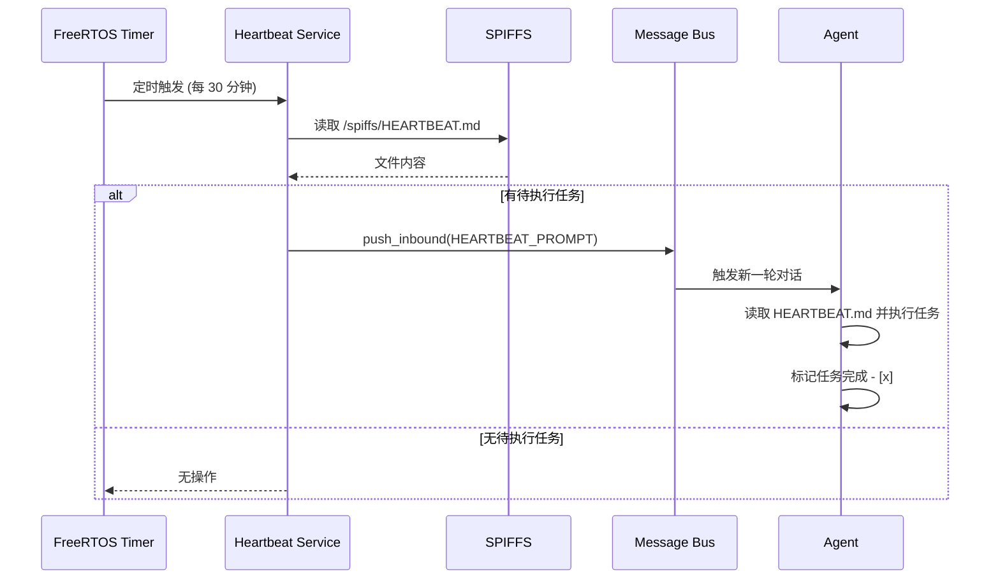

# Heartbeat 定时任务系统

NOTICE: AI 辅助生成, 在实现后台服务时, 请参照代码确认细节!!

本文档介绍 XiaoClaw 的 Heartbeat 定时任务系统，用于定期检查任务文件并触发 Agent 执行待办事项。

## 系统概述

Heartbeat 是基于 FreeRTOS Timer 的定时任务系统，每隔一定时间检查 `HEARTBEAT.md` 文件，如发现待执行任务则通知 Agent 处理。



---

## 1. 工作原理

### 定时检查

Heartbeat 使用 FreeRTOS 软件定时器周期性触发：

```c
s_heartbeat_timer = xTimerCreate(
    "heartbeat",
    pdMS_TO_TICKS(MIMI_HEARTBEAT_INTERVAL_MS),  // 默认 30 分钟
    pdTRUE,    /* auto-reload */
    NULL,
    heartbeat_timer_callback
);
```

### 任务判断逻辑

读取 `HEARTBEAT.md` 时，跳过以下类型的行：

| 类型 | 示例 | 处理 |
|------|------|------|
| 空行/空白行 | `   ` | 跳过 |
| Markdown 标题 | `# TODO` | 跳过 |
| 已完成复选框 | `- [x] 完成任务` | 跳过 |

只有**未完成的任务行**才会触发 Agent：

```c
// 待执行的任务格式
- [ ] 发送每周报告
- 提醒用户喝水
* 检查邮件
```

---

## 2. HEARTBEAT.md 格式

### 文件位置

```
/spiffs/HEARTBEAT.md
```

### 文件格式

```markdown
# Heartbeat Tasks

## 待执行任务

- [ ] 发送每周报告给团队
- [ ] 检查并回复未读邮件
- [ ] 更新项目进度文档

## 周期性提醒

- [ ] 每天早上 9 点提醒团队站会
- [ ] 每周五下午总结本周工作

## 已完成

- [x] 发送昨日数据报告
- [x] 备份数据库
```

### 触发 Agent 的 Prompt

当发现待执行任务时，Heartbeat 发送以下 Prompt 给 Agent：

```
Read /spiffs/HEARTBEAT.md and follow any instructions or tasks listed there. If nothing needs attention, reply with just: HEARTBEAT_OK
```

---

## 3. API 参考

| 函数 | 说明 |
|------|------|
| `heartbeat_init(void)` | 初始化 Heartbeat 服务 |
| `heartbeat_start(void)` | 启动定时器，开始周期性检查 |
| `heartbeat_stop(void)` | 停止并删除定时器 |
| `heartbeat_trigger(void)` | 手动触发一次检查（用于 CLI 测试） |

### 使用示例

```c
// 初始化
heartbeat_init();

// 启动定时任务
heartbeat_start();

// 手动触发检查
if (heartbeat_trigger()) {
    ESP_LOGI(TAG, "Agent 被通知处理 Heartbeat 任务");
} else {
    ESP_LOGI(TAG, "没有待执行的 Heartbeat 任务");
}
```

---

## 4. 配置参数

| 参数 | 默认值 | 说明 |
|------|--------|------|
| `MIMI_HEARTBEAT_FILE` | `/spiffs/HEARTBEAT.md` | 任务文件路径 |
| `MIMI_HEARTBEAT_INTERVAL_MS` | `30 * 60 * 1000` (30 分钟) | 检查间隔 |

---

## 5. 相关文件

| 文件 | 说明 |
|------|------|
| `main/mimi/heartbeat/heartbeat.h` | Heartbeat 公共 API |
| `main/mimi/heartbeat/heartbeat.c` | Heartbeat 实现 |
| `spiffs_data/HEARTBEAT.md` | 任务文件（需用户创建） |

---

## 6. 与 Cron 的区别

| 特性 | Heartbeat | Cron |
|------|-----------|------|
| **触发方式** | Agent 主动检查 HEARTBEAT.md | 定时任务触发消息 |
| **任务来源** | 用户写在 HEARTBEAT.md | Agent 通过 cron_add 创建 |
| **适用场景** | 开放式待办事项 | 明确时间的定时任务 |
| **执行时机** | 固定间隔（30 分钟） | 指定时间点 |
