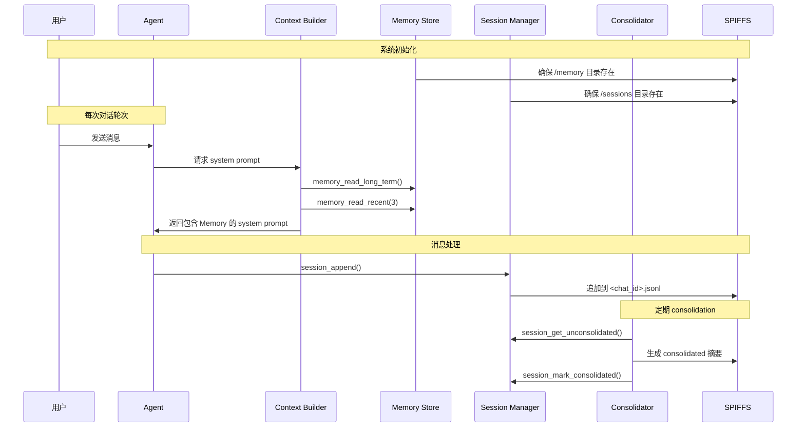
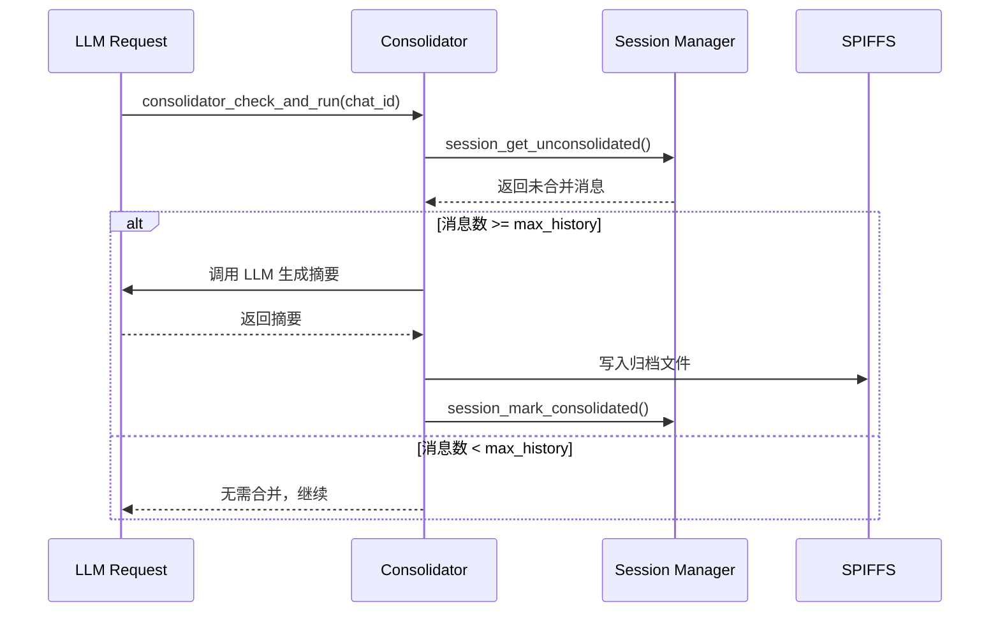

# Memory 系统架构

NOTICE: AI 辅助生成, 在实现后台服务时, 请参照代码确认细节!!

本文档介绍 XiaoClaw 的 Memory 系统架构，包括持久化内存（Long-term Memory）、日常笔记（Daily Notes）和会话历史（Session History）的管理机制。

## 系统概述

Memory 系统采用三层存储架构：

| 层级 | 用途 | 存储位置 | 持久化 |
|------|------|----------|--------|
| **Long-term Memory** | 跨会话持久化存储重要信息 | `/spiffs/memory/MEMORY.md` | 长期 |
| **Daily Notes** | 按日期记录的日常事件 | `/spiffs/memory/daily/<YYYY-MM-DD>.md` | 长期 |
| **Session History** | 当前会话的对话历史 | `/spiffs/sessions/<chat_id>.jsonl` | 长期 |

### Memory 工作流程



---

## 1. Long-term Memory（长期记忆）

### 存储位置

```
/spiffs/memory/MEMORY.md
```

### 内容格式

```markdown
# Long-term Memory

- User name is Zhang San
- Prefers morning reminders at 9:00
- Interested in technology and AI
- Has a pet dog named Wangcai
```

### API

| 函数 | 说明 |
|------|------|
| `memory_read_long_term(buf, size)` | 读取 MEMORY.md 内容 |
| `memory_write_long_term(content)` | 写入 MEMORY.md（全量覆盖） |

NOTICE: 写入前应先读取现有内容，合并更新而非全量覆盖。

---

## 2. Daily Notes（日常笔记）

### 写入方式

NOTICE: Daily Notes 由 Agent 主动写入，非系统自动生成。Agent 根据系统提示词指令判断何时写入。

Agent 会在以下情况写入 Daily Notes：
- 对话中发生值得记录的事件
- 用户告知重要信息但不需要长期记忆
- 定时任务触发等系统事件

### 存储位置

```
/spiffs/memory/daily/
  2026-04-18.md
  2026-04-17.md
  2026-04-16.md
  ...
```

### 文件格式

```markdown
# 2026-04-18

- User asked to set alarm for 7:00 AM
- Discussed weather forecast for the weekend
- User mentioned they like hiking
```

### API

| 函数 | 说明 |
|------|------|
| `memory_append_today(note)` | 追加内容到今天的日记 |
| `memory_read_recent(buf, size, days)` | 读取最近 N 天的日记 |

---

## 3. Session History（会话历史）

### 存储结构

```
/spiffs/sessions/
  123456.jsonl       (Telegram chat_id)
  987654.jsonl       (另一个会话)
  metadata/
    123456.json      (会话元数据)
    987654.json      (会话元数据)
```

### 消息格式（JSONL）

每行一条 JSON 消息：

```json
{"role":"user","content":"Hello","timestamp":1744982400}
{"role":"assistant","content":"Hi there!","timestamp":1744982415}
{"role":"user","content":"How are you?","timestamp":1744982420}
```

### Session Metadata 结构

```json
{
  "key": "telegram:123456",
  "last_consolidated": 50,
  "total_messages": 128,
  "cursor": 128,
  "created_at": 1744900000,
  "updated_at": 1744982400
}
```

### API

| 函数 | 说明 |
|------|------|
| `session_append(chat_id, role, content)` | 追加消息到会话 |
| `session_get_history_json(chat_id, buf, max_msgs)` | 获取最近 N 条消息 |
| `session_get_unconsolidated(chat_id, buf, remaining)` | 获取未合并的消息 |
| `session_mark_consolidated(chat_id, count)` | 标记消息为已合并 |
| `session_read_after_cursor(chat_id, cursor, next_cursor)` | 从游标位置读取 |
| `session_advance_cursor(chat_id, new_cursor)` | 更新游标位置 |
| `session_get_message_count(chat_id)` | 获取消息总数 |
| `session_clear(chat_id)` | 删除会话 |

---

## 4. Consolidator（记忆合并）

### 功能说明

Consolidator 在每次 LLM 请求前运行，将旧的会话消息合并为摘要，防止会话历史无限增长。

### 配置参数

| 参数 | 默认值 | 说明 |
|------|--------|------|
| `max_history` | 50 | consolidation 前保留的最大消息数 |
| `consolidate_batch` | 20 | 每次合并的消息数 |
| `archive_max_lines` | 500 | 归档文件最大行数 |

### Consolidation 流程



### API

| 函数 | 说明 |
|------|------|
| `consolidator_init(config)` | 初始化 consolidator |
| `consolidator_check_and_run(chat_id)` | 检查并执行 consolidation |
| `consolidator_force_run(chat_id)` | 强制执行 consolidation |

---

## 5. System Prompt 集成

### Memory Section 注入

Context Builder 在每次构建 System Prompt 时注入 Memory 信息：

```
## Memory

You have persistent memory stored on local flash:
- Long-term memory: /spiffs/memory/MEMORY.md
- Daily notes: /spiffs/memory/daily/<YYYY-MM-DD>.md

IMPORTANT: Actively use memory to remember things across conversations.
- When you learn something new about the user (name, preferences, habits, context), write it to MEMORY.md.
- When something noteworthy happens in a conversation, append it to today's daily note.
- Always read_file MEMORY.md before writing, so you can edit_file to update without losing existing content.
- Use get_current_time to know today's date before writing daily notes.
- Keep MEMORY.md concise and organized — summarize, don't dump raw conversation.
- You should proactively save memory without being asked.

## Long-term Memory

[MEMORY.md 内容]

## Recent Notes

[最近 3 天的日记]
```

---

## 6. 相关文件

| 文件 | 说明 |
|------|------|
| `main/mimi/memory/memory_store.h` | Memory Store 公共 API |
| `main/mimi/memory/memory_store.c` | Memory Store 实现 |
| `main/mimi/memory/session_manager.h` | Session Manager 公共 API |
| `main/mimi/memory/session_manager.c` | Session Manager 实现 |
| `main/mimi/memory/consolidator.h` | Consolidator 公共 API |
| `main/mimi/memory/consolidator.c` | Consolidator 实现 |
| `main/mimi/agent/context_builder.c` | System Prompt 构建，包含 Memory 注入 |
| `spiffs_data/memory/MEMORY.md` | 长期记忆文件 |
| `spiffs_data/memory/daily/` | 日常笔记目录 |

---

## 7. 存储目录结构

```
/spiffs/
  memory/
    MEMORY.md                    # 长期记忆
    daily/
      2026-04-18.md             # 今天的日记
      2026-04-17.md             # 昨天的日记
      2026-04-16.md             # 前天的日记
  sessions/
    123456.jsonl                # 会话消息 (JSONL)
    987654.jsonl                # 另一个会话
    metadata/
      123456.json               # 会话元数据
      987654.json               # 另一个会话元数据
```
