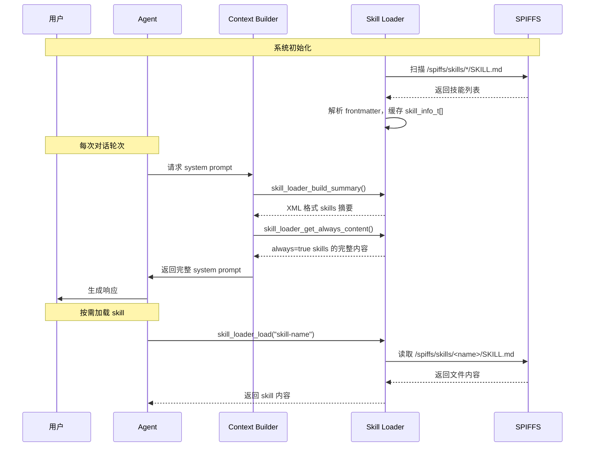

# Skills 系统架构

本文档介绍 XiaoClaw 的 Skills 系统架构，包括目录结构、Frontmatter 格式、System Prompt 集成方式及关键 API。

## 系统概述

Skills 是 XiaoClaw 扩展能力的模块化方案。每个 Skill 是一个独立的功能单元，包含在 SPIFFS 文件系统的独立目录中，以 `SKILL.md` 文件形式存在。

### Skills 工作流程



---

## 目录结构

```
spiffs_data/skills/
  mcp-servers/
    SKILL.md         (always: true)
  skill-creator/
    SKILL.md         (always: false)
  lua-scripts/
    SKILL.md         (always: false)
  <custom-skill>/
    SKILL.md
```

NOTICE: 每个 Skill 必须是独立目录，入口文件必须命名为 `SKILL.md`。

---

## Frontmatter 格式规范

SKILL.md 文件顶部使用 YAML frontmatter：

```yaml
---
name: <skill-name>
description: <brief description>
always: <true|false>
---
```

### 字段说明

| 字段 | 类型 | 必填 | 说明 |
|------|------|------|------|
| `name` | string | 是 | Skill 标识名，需与目录名一致 |
| `description` | string | 是 | 简短描述，出现在 skills 摘要 XML 中 |
| `always` | boolean | 否 | `true` 表示始终注入 system prompt，默认 `false` |

### 示例

```yaml
---
name: mcp-servers
description: Connect to MCP servers and use remote tools
always: true
---
```

---

## System Prompt 集成方式

### Skills 摘要 XML

`skill_loader_build_summary()` 生成 XML 格式摘要：

```xml
<skills>
  <skill available="true">
    <name>lua-scripts</name>
    <description>Execute Lua scripts for custom logic and HTTP requests</description>
    <location>/spiffs/skills/lua-scripts/SKILL.md</location>
  </skill>
  <skill available="true">
    <name>mcp-servers</name>
    <description>Connect to MCP servers and use remote tools</description>
    <location>/spiffs/skills/mcp-servers/SKILL.md</location>
  </skill>
</skills>
```

### Always Skills 注入

`skill_loader_get_always_content()` 获取所有 `always=true` skill 的完整内容，拼接后注入 system prompt。

### System Prompt 中的 Skills Section

```
## Skills

### Active Skills
<mcp-servers skill 完整内容>

### Available Skills (read full instructions with read_file when needed)
<skills>
  <skill available="true">
    <name>lua-scripts</name>
    ...
  </skill>
</skills>
```

---

## 关键代码文件

| 文件 | 说明 |
|------|------|
| `main/mimi/skills/skill_loader.h` | Skill Loader 公共 API 头文件 |
| `main/mimi/skills/skill_loader.c` | Skill Loader 实现，SPIFFS 扫描、frontmatter 解析 |
| `main/mimi/agent/context_builder.c` | System Prompt 构建，包含 skills 注入逻辑 |
| `spiffs_data/skills/` | Skill 文件存储目录 |

---

## API 参考

### skill_loader_init

```c
esp_err_t skill_loader_init(void);
```

初始化 skills 系统，扫描 SPIFFS 中的 `SKILL.md` 文件并解析 frontmatter。

**返回值**: `ESP_OK` on success

---

### skill_loader_list

```c
int skill_loader_list(skill_info_t *skills, int max);
```

列出所有可用 skills。

| 参数 | 类型 | 说明 |
|------|------|------|
| `skills` | `skill_info_t*` | 输出数组（调用者分配） |
| `max` | `int` | 最大返回数量 |

**返回值**: 实际找到的 skills 数量

---

### skill_loader_load

```c
esp_err_t skill_loader_load(const char *name, char *buf, size_t size);
```

按名称加载指定 skill 内容。

| 参数 | 类型 | 说明 |
|------|------|------|
| `name` | `const char*` | Skill 名称（目录名） |
| `buf` | `char*` | 输出 buffer |
| `size` | `size_t` | buffer 大小 |

**返回值**: `ESP_OK` on success, `ESP_ERR_NOT_FOUND` if skill not found

---

### skill_loader_get_always_content

```c
size_t skill_loader_get_always_content(char *buf, size_t size);
```

获取所有 `always=true` skills 的完整内容，用 `\n---\n` 分隔。

| 参数 | 类型 | 说明 |
|------|------|------|
| `buf` | `char*` | 输出 buffer |
| `size` | `size_t` | buffer 大小 |

**返回值**: 写入的字节数

---

### skill_loader_build_summary

```c
size_t skill_loader_build_summary(char *buf, size_t size);
```

构建 XML 格式的 skills 摘要。

| 参数 | 类型 | 说明 |
|------|------|------|
| `buf` | `char*` | 输出 buffer |
| `size` | `size_t` | buffer 大小 |

**返回值**: 写入的字节数

---

## skill_info_t 结构

```c
typedef struct {
    char name[32];        // Skill 名称
    char description[128]; // 简短描述
    bool always;          // 是否始终注入
    bool available;       // 依赖是否满足
    char path[256];       // SKILL.md 完整路径
    char source;          // 'w'=workspace, 'b'=builtin
} skill_info_t;
```

---

## 相关文档

- [Skills 参考指南](./skills-reference.md) - Skill 文件编写规范
- [内置 Skills](./skills-builtin.md) - 内置 Skills 详细说明
