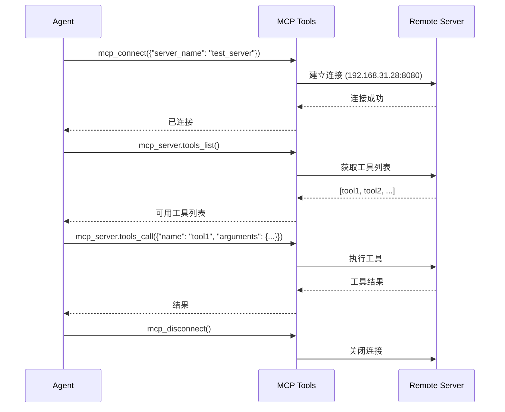

# 内置 Skills

XiaoClaw 预置了三个内置 Skills，分别用于 Lua 脚本执行、MCP 服务器连接和创建新 skill。

---

## lua-scripts

### 基本信息

| 属性 | 值 |
|------|------|
| 目录 | `spiffs_data/skills/lua-scripts/` |
| always | `false` |
| 描述 | Execute Lua scripts for custom logic and HTTP requests |

### 功能说明

在 SPIFFS 文件系统上执行 Lua 脚本，或直接运行 Lua 代码片段。内置 `http_get`、`http_post` 等函数用于 HTTP 请求。

### 适用场景

- 用户请求运行存储的脚本
- 需要执行简单 Web 搜索无法满足的 HTTP 请求
- 需要自定义逻辑或计算
- 快速测试 Lua 代码片段

### 可用工具

| 工具 | 用途 |
|------|------|
| `lua_run` | 执行 SPIFFS 上存储的 Lua 脚本（路径：`/spiffs/lua/<name>.lua`） |
| `lua_eval` | 直接执行 Lua 代码字符串 |

### 内置 Lua 函数

| 函数 | 描述 | 返回值 |
|------|------|--------|
| `print(...)` | 输出文本 | - |
| `http_get(url)` | HTTP GET 请求 | `(body, status_code)` |
| `http_post(url, body, content_type)` | HTTP POST 请求 | `(body, status_code)` |
| `http_put(url, body, content_type)` | HTTP PUT 请求 | `(body, status_code)` |
| `http_delete(url)` | HTTP DELETE 请求 | `(body, status_code)` |

### 存储脚本示例

**`/spiffs/lua/hello.lua`**:
```lua
print("Hello from Lua!")
```

**`/spiffs/lua/http_example.lua`**:
```lua
local body, code = http_get("https://api.example.com/data")
print("Status: " .. code)
print("Body: " .. body)
```

---

## mcp-servers

### 基本信息

| 属性 | 值 |
|------|------|
| 目录 | `spiffs_data/skills/mcp-servers/` |
| always | `true` |
| 描述 | Connect to MCP servers and use remote tools |

### 功能说明

连接 MCP（Model Context Protocol）服务器，访问运行在远程服务器上的工具。

### 适用场景

- 用户请求连接 MCP 服务器或使用远程工具
- 需要访问部署在其他服务器上的工具
- 需要扩展 XiaoClaw 的工具能力

### 可用工具

| 工具 | 用途 |
|------|------|
| `mcp_connect` | 连接到指定的 MCP 服务器 |
| `mcp_disconnect` | 断开与 MCP 服务器的连接 |
| `mcp_server.tools_list` | 连接后获取可用远程工具列表 |
| `mcp_server.tools_call` | 执行指定的远程工具 |

### 工作流程



### 服务器配置格式

在 `SKILL.md` 中按以下格式配置服务器：

```markdown
## <server_name>
- host: <IP 地址或域名>
- port: <端口号>
- endpoint: <MCP 端点路径>
```

NOTICE: 服务器必须在连接前启动运行。连接参数在 `mcp-servers/SKILL.md` 中配置。

---

## skill-creator

### 基本信息

| 属性 | 值 |
|------|------|
| 目录 | `spiffs_data/skills/skill-creator/` |
| always | `false` |
| 描述 | Create new skills for XiaoClaw |

### 功能说明

创建新的 Skills 来扩展 XiaoClaw 的能力。

### 适用场景

- 用户请求创建新 skill 或教 bot 新技能
- 用户想添加自定义能力或工作流
- 用户请求保存指令以供后续使用

### 创建步骤

1. **选择名称**: 简短描述性名称（小写，可含连字符）
2. **创建目录**: 在 `/spiffs/skills/<name>/` 下创建
3. **编写 SKILL.md**: 按规范编写 skill 文件

### 新建 Skill 文件结构

```markdown
---
name: my-skill
description: Brief description of what this skill does
always: false
---

# My Skill

Describe what this skill does here.

## When to Use

When the user wants [specific task].

## How to Use

1. Step one
2. Step two
```

### 最佳实践

- **简洁**: Context window 有限，保持简洁
- **专注**: 描述做什么，而非怎么做（Agent 很智能）
- **清晰**: 使用简洁清晰的语言
- **测试**: 创建后通过询问 Agent 来测试

### 创建后验证

1. 重启设备或触发 skill_loader 重新扫描
2. 使用工具列表确认新 skill 出现
3. 测试 skill 功能是否正常

---

## 相关文档

- [Skills 系统架构](./skills-architecture.md) - 系统设计说明
- [Skills 参考指南](./skills-reference.md) - Skill 文件编写规范
