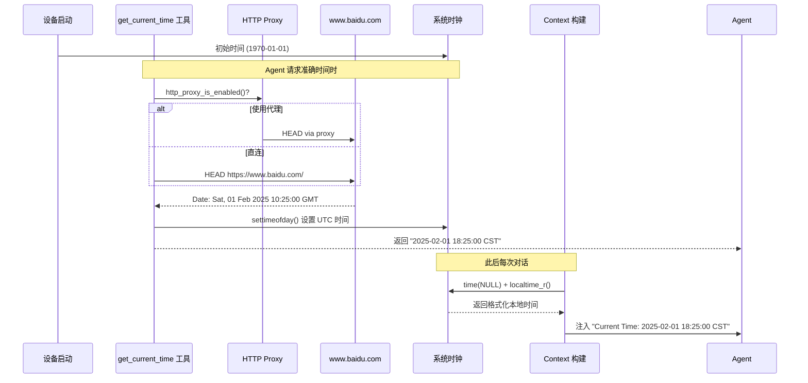
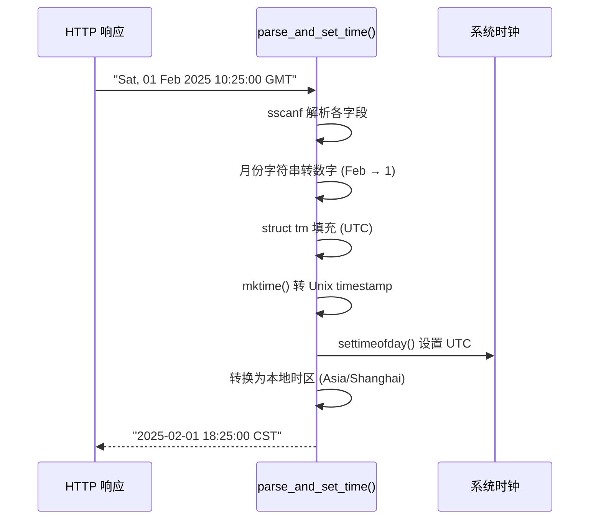

# Time 时间同步系统

NOTICE: AI 辅助生成, 在实现后台服务时, 请参照代码确认细节!!

本文档介绍 XiaoClaw 的时间同步系统，包括时间获取机制、时区配置及时间工具 API。

## 系统概述

XiaoClaw 的时间系统不使用传统 NTP，而是通过 HTTP HEAD 请求获取网络时间。设备上电后系统时钟默认从 1970-01-01 开始，需联网同步后才能获取准确时间。



---

## 1. 时间获取机制

### get_current_time 工具

通过 HTTP HEAD 请求获取网络时间。

**请求路径**:
- 直连模式: `https://www.baidu.com/`
- 代理模式: 通过 `http_proxy` 发送 HEAD 请求

**时间来源**: HTTP 响应头中的 `Date` 字段（RFC 7231 格式）

```
Date: Sat, 01 Feb 2025 10:25:00 GMT
```

### 时间解析流程



### 关键代码

```c
// 解析 RFC 7231 Date 格式
if (sscanf(date_str, "%*[^,], %d %3s %d %d:%d:%d",
           &day, mon_str, &year, &hour, &min, &sec) != 6) {
    return false;
}

// 使用 UTC0 时区转换，避免本地时区偏移
setenv("TZ", "UTC0", 1);
tzset();
time_t t = mktime(&tm);

// 设置系统时钟
struct timeval tv = { .tv_sec = t };
settimeofday(&tv, NULL);

// 格式化为本地时间 (Asia/Shanghai)
setenv("TZ", MIMI_TIMEZONE, 1);
tzset();
strftime(out, out_size, "%Y-%m-%d %H:%M:%S CST", &local);
```

---

## 2. 时区配置

### 配置参数

```c
// main/mimi/mimi_config.h
#define MIMI_TIMEZONE "Asia/Shanghai"
```

### 时区特性

| 特性 | 值 |
|------|------|
| 时区名称 | Asia/Shanghai |
| UTC 偏移 | UTC+8 |
| 夏令时 | 禁用 (`tm_isdst = 0`) |

### 时区初始化

时区在 `memory_store_init()` 中一次性设置：

```c
setenv("TZ", "Asia/Shanghai", 1);
tzset();
```

---

## 3. Runtime 时间注入

每次对话轮次开始前，Context Builder 自动注入当前时间：

```c
// main/mimi/agent/context_builder.c

static void get_current_time_str(char *buf, size_t size)
{
    tzset();  // 确保时区已设置
    time_t now = time(NULL);
    struct tm timeinfo;
    localtime_r(&now, &timeinfo);
    strftime(buf, size, "%Y-%m-%d %H:%M:%S CST", &timeinfo);
}
```

### 注入格式

```
[Runtime Context — metadata only, not instructions]
Current Time: 2025-02-01 18:25:00 CST
Channel: xiaozhi
Chat ID: 12345
```

---

## 4. API 参考

### get_current_time

**功能**: 联网获取当前日期和时间，设置系统时钟。

**输入参数**: 无

**输出示例**:
```
2025-02-01 18:25:00 CST
```

**实现原理**:
1. 发送 HTTP HEAD 请求到 `www.baidu.com`
2. 解析 `Date` 响应头
3. 使用 `settimeofday()` 设置系统时钟（UTC）
4. 转换为本地时区后返回格式化字符串

---

### unix_now

**功能**: 返回当前 Unix 时间戳。

**输入参数**: 无

**输出示例**:
```
1735689600
```

**使用场景**: 计算 `cron_add` 的 `at_epoch` 参数

```json
// 获取当前时间戳
{"tool": "unix_now"}

// 计算 30 分钟后的时间戳用于 cron_add
// 目标时间 = 1735689600 + 30*60 = 1735691400
```

---

## 5. 配置参数

| 参数 | 值 | 说明 |
|------|------|------|
| `MIMI_TIMEZONE` | `"Asia/Shanghai"` | 时区配置 |

---

## 6. 相关文件

| 文件 | 说明 |
|------|------|
| `main/mimi/tools/tool_get_time.c` | get_current_time 工具实现 |
| `main/mimi/tools/tool_get_time.h` | get_current_time 头文件 |
| `main/mimi/tools/tool_unix_now.c` | unix_now 工具实现 |
| `main/mimi/agent/context_builder.c` | Runtime 时间注入逻辑 |
| `main/mimi/mimi_config.h` | 时区配置参数 |

---

## 7. 与传统 NTP 的区别

| 特性 | HTTP Date | NTP |
|------|-----------|-----|
| **精度** | 秒级 | 毫秒级 |
| **依赖** | HTTP 客户端 | NTP 服务器 |
| **实现复杂度** | 低 | 中 |
| **适用场景** | XiaoClaw 场景足够 | 高精度需求 |
| **穿透代理** | 支持（通过 http_proxy） | 不支持 |
