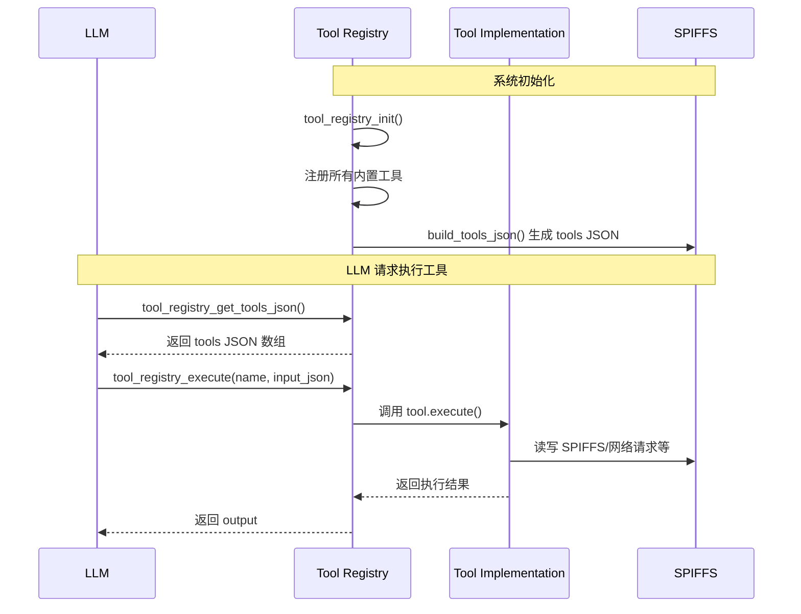

# Tools 系统架构

本文档介绍 XiaoClaw 的 Tools 系统架构，包括工具注册机制、内置工具列表及执行流程。

## 系统概述

Tools 是 XiaoClaw 提供给 Agent 的可执行功能单元。与 Skills（纯文本指令）不同，Tools 具有实际的执行逻辑，可以读写文件系统、发起网络请求、调度定时任务等。

### Tools 工作流程



---

## 核心组件

### Tool Registry

`tool_registry.c` 是工具系统的核心，负责：
- 注册所有内置工具
- 维护工具列表和 JSON 缓存
- 根据名称查找并执行工具
- 支持动态添加远程工具（MCP）

### mimi_tool_t 结构

```c
typedef struct {
    const char *name;              // 工具名称
    const char *description;       // 工具描述
    const char *input_schema_json;  // JSON Schema 输入参数
    mimi_tool_execute_t execute;   // 执行函数
    bool concurrency_safe;        // 是否并发安全
    mimi_tool_prepare_t prepare;   // 可选的预处理钩子
} mimi_tool_t;
```

### 执行函数签名

```c
typedef esp_err_t (*mimi_tool_execute_t)(const char *input_json,
                                         char *output, size_t output_size);
```

---

## 内置工具列表

### 文件操作工具

| 工具名 | 描述 | 输入参数 | 并发安全 |
|--------|------|----------|----------|
| `read_file` | 读取 SPIFFS 文件 | `{"path": "..."}` | 是 |
| `write_file` | 写入/覆盖 SPIFFS 文件 | `{"path": "...", "content": "..."}` | 否 |
| `edit_file` | 查找替换文件内容 | `{"path": "...", "old_string": "...", "new_string": "..."}` | 否 |
| `list_dir` | 列出目录文件 | `{"prefix": "..."}` (可选) | 是 |

NOTICE: 路径必须以 `MIMI_FATFS_BASE` 开头（如 `/spiffs/`）。

---

### 时间工具

| 工具名 | 描述 | 输入参数 | 并发安全 |
|--------|------|----------|----------|
| `get_datetime` | 获取当前日期时间，设置系统时钟 | `{}` | 是 |
| `get_unix_timestamp` | 获取当前 Unix 时间戳（秒） | `{}` | 是 |

---

### 定时任务工具

| 工具名 | 描述 | 输入参数 | 并发安全 |
|--------|------|----------|----------|
| `cron_add` | 添加定时任务 | 参见下方详细参数 | 否 |
| `cron_list` | 列出所有定时任务 | `{}` | 是 |
| `cron_remove` | 删除定时任务 | `{"job_id": "..."}` | 否 |

#### cron_add 详细参数

```json
{
  "name": "任务名称",
  "schedule_type": "every | at",
  "interval_s": 3600,           // 'every' 模式：间隔秒数
  "remind_in_seconds": 180,      // 'at' 模式：多少秒后触发
  "at_epoch": 1744982400,        // 'at' 模式：Unix 时间戳
  "message": "触发时注入的消息",
  "channel": "telegram",         // 可选：回复渠道
  "chat_id": "123456"            // 可选：聊天 ID
}
```

---

### 网络工具

| 工具名 | 描述 | 输入参数 | 并发安全 |
|--------|------|----------|----------|
| `web_search` | 网页搜索（ Tavily 或 Brave Search） | `{"query": "..."}` | 是 |

需要配置 API Key：
- `tool_web_search_set_key()` - 设置 Brave Search API Key
- `tool_web_search_set_tavily_key()` - 设置 Tavily API Key

---

### Lua 脚本工具

| 工具名 | 描述 | 输入参数 | 并发安全 |
|--------|------|----------|----------|
| `lua_eval` | 执行 Lua 代码字符串 | `{"code": "..."}` | 否 |
| `lua_run` | 执行 SPIFFS 中的 Lua 脚本 | `{"path": "..."}` | 否 |

脚本路径必须以 `MIMI_FATFS_BASE}/lua/` 开头。

---

## 并发安全模型

工具分为两类：

1. **并发安全（concurrency_safe=true）**：可以与其他工具同时执行
   - 只读操作：`read_file`、`list_dir`、`get_current_time`、`unix_now`、`cron_list`
   - 网络请求：`web_search`

2. **非并发安全（concurrency_safe=false）**：修改文件系统或状态
   - 写操作：`write_file`、`edit_file`
   - 定时任务：`cron_add`、`cron_remove`
   - Lua 执行：`lua_eval`、`lua_run`

Agent 在执行多个工具时，会根据此标志决定是否串行执行非安全工具。

---

## MCP 远程工具

Tools 系统支持通过 MCP（Model Context Protocol）动态发现和注册远程工具：

```c
// 初始化 MCP 客户端
esp_err_t tool_mcp_client_init(void);

// 检查 MCP 是否就绪
bool tool_mcp_client_is_ready(void);

// 释放资源
esp_err_t tool_mcp_client_deinit(void);

// 动态添加远程工具
esp_err_t tool_registry_add(const mimi_tool_t *tool);
void tool_registry_rebuild_json(void);
```

MCP 工具发现后，通过 `tool_registry_add()` 添加到注册表，然后调用 `tool_registry_rebuild_json()` 重建 JSON 缓存。

---

## API 参考

### tool_registry_init

```c
esp_err_t tool_registry_init(void);
```

初始化工具注册表，注册所有内置工具。

**返回值**: `ESP_OK` on success

---

### tool_registry_get_tools_json

```c
const char *tool_registry_get_tools_json(void);
```

获取预构建的 tools JSON 数组字符串，用于 API 请求。

**返回值**: JSON 数组字符串指针，或 NULL

---

### tool_registry_execute

```c
esp_err_t tool_registry_execute(const char *name,
                                const char *input_json,
                                char *output, size_t output_size);
```

按名称执行工具。

| 参数 | 类型 | 说明 |
|------|------|------|
| `name` | `const char*` | 工具名称 |
| `input_json` | `const char*` | JSON 格式输入参数 |
| `output` | `char*` | 输出 buffer |
| `output_size` | `size_t` | buffer 大小 |

**返回值**: `ESP_OK` success, `ESP_ERR_NOT_FOUND` if tool unknown

---

### tool_registry_is_concurrency_safe

```c
bool tool_registry_is_concurrency_safe(const char *name);
```

检查工具是否并发安全。

**返回值**: true if tool can run concurrently

---

### tool_registry_add

```c
esp_err_t tool_registry_add(const mimi_tool_t *tool);
```

动态添加工具到注册表（如 MCP 远程工具）。

**返回值**: `ESP_OK` on success, `ESP_ERR_NO_MEM` if registry full

---

## 相关代码文件

| 文件 | 说明 |
|------|------|
| `main/mimi/tools/tool_registry.h` | Tool Registry 公共 API |
| `main/mimi/tools/tool_registry.c` | Tool Registry 实现 |
| `main/mimi/tools/tool_files.h` | 文件操作工具 API |
| `main/mimi/tools/tool_files.c` | 文件操作工具实现 |
| `main/mimi/tools/tool_get_time.h` | 时间工具 API |
| `main/mimi/tools/tool_cron.h` | 定时任务工具 API |
| `main/mimi/tools/tool_lua.h` | Lua 脚本工具 API |
| `main/mimi/tools/tool_web_search.h` | 网页搜索工具 API |
| `main/mimi/tools/tool_mcp_client.h` | MCP 客户端 API |
