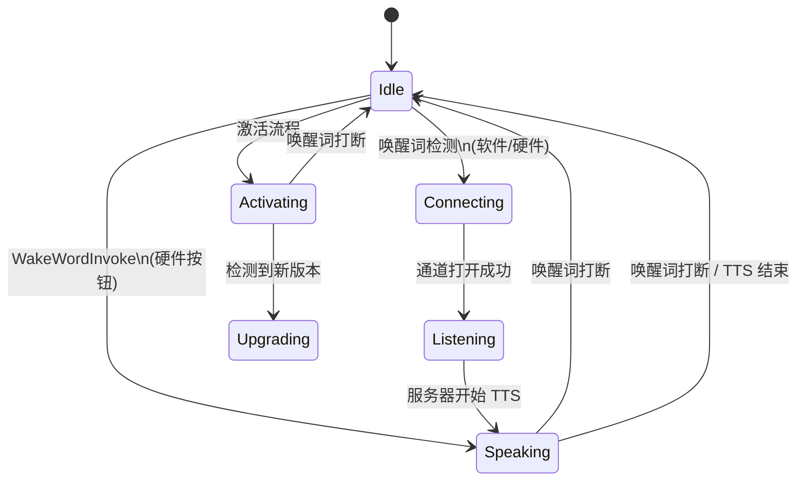
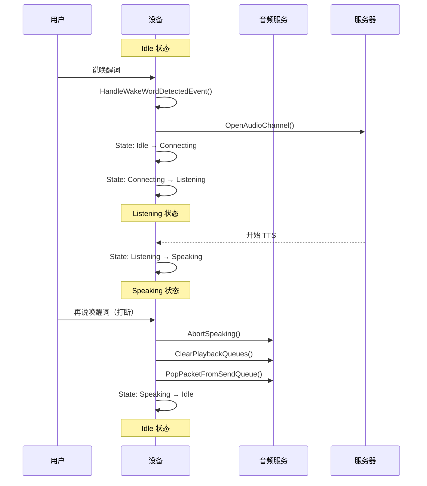

# 唤醒词处理流程

## 1. 架构概述

唤醒词检测有两种触发源：

### 1.1 软件唤醒词检测 (AFE/ESP Wake Word)

通过 `AudioService` 持续监控音频输入，检测到唤醒词后通过事件系统通知应用层。

**代码路径：**
```
AfeWakeWord::AudioDetectionTask()
    → wake_word_detected_callback_(wake_word)
    → xEventGroupSetBits(event_group_, MAIN_EVENT_WAKE_WORD_DETECTED)
    → Application::HandleWakeWordDetectedEvent()
```

**关键文件：**
- `main/audio/wake_words/afe_wake_word.cc` - AFE 唤醒词实现
- `main/audio/audio_service.cc` - 音频输入任务
- `main/application.cc` - 事件处理

### 1.2 硬件触发 (按钮/摄像头)

通过硬件按钮或摄像头目标检测直接调用 `WakeWordInvoke()`。

**代码路径：**
```
Board 按钮/摄像头
    → Application::WakeWordInvoke()
```

**调用位置：**
- `main/boards/*/esp*_board.cc` - ASR 按钮点击
- `main/boards/sensecap-watcher/sscma_camera.cc` - 摄像头目标检测

---

## 2. 状态转换图



## 3. 唤醒词打断时序图



---

## 4. 唤醒词处理函数

### 3.1 HandleWakeWordDetectedEvent() - 软件唤醒词

**位置：** `main/application.cc:804-849`

软件唤醒词检测到后的事件处理，根据当前状态执行不同行为：

```cpp
void Application::HandleWakeWordDetectedEvent() {
    auto state = GetDeviceState();

    if (state == kDeviceStateIdle) {
        // → Connecting → Listening
        audio_service_.EncodeWakeWord();
        if (!protocol_->IsAudioChannelOpened()) {
            SetDeviceState(kDeviceStateConnecting);
            Schedule([this, wake_word]() {
                ContinueWakeWordInvoke(wake_word);
            });
            return;
        }
        ContinueWakeWordInvoke(wake_word);

    } else if (state == kDeviceStateSpeaking) {
        // → Idle (打断 TTS)
        AbortSpeaking(kAbortReasonWakeWordDetected);
        while (audio_service_.PopPacketFromSendQueue());
        audio_service_.ClearPlaybackQueues();
        SetDeviceState(kDeviceStateIdle);

    } else if (state == kDeviceStateListening) {
        // → Listening (重启监听)
        AbortSpeaking(kAbortReasonWakeWordDetected);
        while (audio_service_.PopPacketFromSendQueue());
        audio_service_.ClearPlaybackQueues();
        protocol_->SendStartListening(GetDefaultListeningMode());
        audio_service_.ResetDecoder();
        audio_service_.PlaySound(Lang::Sounds::OGG_POPUP);
        audio_service_.EnableWakeWordDetection(true);

    } else if (state == kDeviceStateActivating) {
        // → Idle (重启激活检查)
        SetDeviceState(kDeviceStateIdle);
    }
}
```

### 3.2 WakeWordInvoke() - 硬件触发

**位置：** `main/application.cc:1053-1090`

硬件按钮或摄像头检测到唤醒词时调用：

```cpp
void Application::WakeWordInvoke(const std::string& wake_word) {
    auto state = GetDeviceState();

    if (state == kDeviceStateIdle) {
        // 同 HandleWakeWordDetectedEvent
        audio_service_.EncodeWakeWord();
        if (!protocol_->IsAudioChannelOpened()) {
            SetDeviceState(kDeviceStateConnecting);
            Schedule([this, wake_word]() {
                ContinueWakeWordInvoke(wake_word);
            });
            return;
        }
        ContinueWakeWordInvoke(wake_word);

    } else if (state == kDeviceStateSpeaking) {
        // → Idle (打断 TTS)
        Schedule([this]() {
            AbortSpeaking(kAbortReasonWakeWordDetected);
            while (audio_service_.PopPacketFromSendQueue());
            audio_service_.ClearPlaybackQueues();
            SetDeviceState(kDeviceStateIdle);
        });

    } else if (state == kDeviceStateListening) {
        // → Idle (关闭通道)
        Schedule([this]() {
            if (protocol_) {
                protocol_->CloseAudioChannel();
            }
            SetDeviceState(kDeviceStateIdle);
        });
    }
}
```

---

## 5. 各状态下唤醒词行为

| 当前状态 | HandleWakeWordDetectedEvent (软件) | WakeWordInvoke (硬件) |
|---------|----------------------------------|---------------------|
| Idle | → Connecting → Listening | → Connecting → Listening |
| Speaking | → Listening | → Listening |
| Listening | → Listening (重启监听) | → Idle (关闭通道) |
| Activating | → Idle | (同上) |

**注意：** Speaking 状态时唤醒词打断会：
1. 终止当前 TTS 播放 (`AbortSpeaking`)
2. 清除待发送音频队列 (`PopPacketFromSendQueue`)
3. 清除播放队列 (`ClearPlaybackQueues`)
4. 切换到 Listening 状态（重新开始对话）

---

## 6. 唤醒词检测使能时机

在 `HandleStateChangedEvent()` 中根据状态控制唤醒词检测：

| 状态 | EnableWakeWordDetection | 说明 |
|------|------------------------|------|
| Idle | `true` | 始终开启 |
| Connecting | - | 保持之前状态 |
| Listening | `IsAfeWakeWord()` 或 `false` | 取决于配置 |
| Thinking | `false` | 始终关闭 |
| Speaking | `IsAfeWakeWord()` | **仅 AFE 唤醒词可在说话时检测** |
| WifiConfiguring | `false` | 始终关闭 |

```cpp
case kDeviceStateSpeaking:
    if (listening_mode_ != kListeningModeRealtime) {
        audio_service_.EnableWakeWordDetection(audio_service_.IsAfeWakeWord());
    }
```

---

## 7. 关键函数说明

### ContinueWakeWordInvoke()

唤醒词检测后打开音频通道并切换到 Listening 状态。

**位置：** `main/application.cc:851-882`

### AbortSpeaking()

通知服务器终止当前说话会话。

**位置：** `main/application.cc:971-977`

### ClearPlaybackQueues()

立即清空播放队列，停止当前 TTS 音频输出。

**调用位置：** `audio_service_.ClearPlaybackQueues()`

---

## 8. 调试日志

启用以下日志标签可观察唤醒词流程：

```
StateMachine: 状态转换
Application: 唤醒词事件处理
AudioService: 音频队列操作
Protocol: 服务器通信
```
